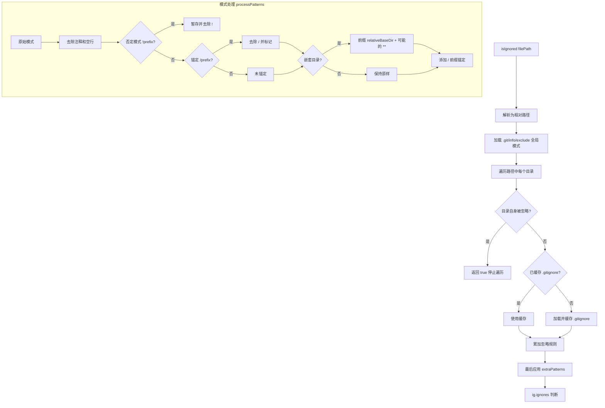

# gitIgnoreParser.ts

> 完整实现 .gitignore 规则解析器，支持嵌套 .gitignore、.git/info/exclude 和额外 pattern

## 概述
`gitIgnoreParser.ts` 实现了一个符合 Git 语义的 `.gitignore` 规则解析和匹配引擎。与简单的 glob 匹配不同，它正确处理了嵌套 `.gitignore` 文件的作用域、锚定模式、否定模式以及 `.git/info/exclude` 全局排除。该文件是文件发现服务（FileDiscoveryService）的核心依赖，确保工具在遍历文件系统时尊重项目的忽略规则。

## 架构图

## 主要导出

### 接口
- **`GitIgnoreFilter`** — 过滤器接口，定义 `isIgnored(filePath: string): boolean`

### 类
- **`GitIgnoreParser implements GitIgnoreFilter`** — 核心解析器类
  - **`constructor(projectRoot: string, extraPatterns?: string[])`** — 初始化，extraPatterns 用于 .geminiignore 等额外规则
  - **`isIgnored(filePath: string): boolean`** — 判断文件路径是否被忽略

## 核心逻辑
1. **模式作用域处理**（`processPatterns`）：嵌套 `.gitignore` 中的模式需要根据其相对位置转换——未锚定且无斜杠的模式加 `**/` 前缀（匹配任意子目录），有斜杠或锚定的模式加目录前缀后锚定。
2. **目录级联**：`isIgnored` 从项目根目录向下逐层加载 `.gitignore`，检查每个中间目录是否已被忽略（Git 行为：被忽略目录内的 `.gitignore` 不生效）。
3. **懒加载缓存**：`.git/info/exclude` 首次调用时加载，每个目录的 `.gitignore` 通过 `cache: Map<string, Ignore>` 缓存。
4. **额外模式优先级**：`extraPatterns`（如 `.geminiignore`）在所有规则之后应用，具有最高优先级。
5. **跨平台兼容**：路径统一转换为正斜杠（`replace(/\\/g, '/')`），`.git` 目录始终被忽略。

## 内部依赖
无

## 外部依赖
- `ignore` — gitignore 模式匹配引擎
- `node:fs` — 同步文件读取（用于 .gitignore 加载）
- `node:path` — 路径操作
