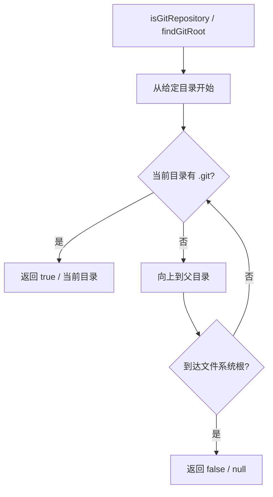

# gitUtils.ts

> 提供 Git 仓库检测和根目录查找的基础工具函数

## 概述
`gitUtils.ts` 提供了两个简洁的 Git 仓库相关工具函数：检测目录是否在 Git 仓库内，以及查找 Git 仓库的根目录。通过向上遍历目录树查找 `.git` 目录（或文件，支持 worktree 场景）来实现。该文件在模块中作为 Git 相关功能的基础判断层。

## 架构图

## 主要导出

### 函数
- **`isGitRepository(directory: string): boolean`** — 同步检查目录是否位于 Git 仓库内
- **`findGitRoot(directory: string): string | null`** — 同步查找 Git 仓库根目录，不在仓库内返回 null

## 核心逻辑
- 两个函数逻辑相同：使用 `fs.existsSync` 逐级向上查找 `.git`，区别仅在返回值（布尔值 vs 路径）。
- 使用 `path.dirname` 判断是否到达根目录（`parentDir === currentDir`）。
- 异常时安全返回 `false` / `null`。

## 内部依赖
无

## 外部依赖
- `node:fs` — 同步文件存在检查
- `node:path` — 路径操作
