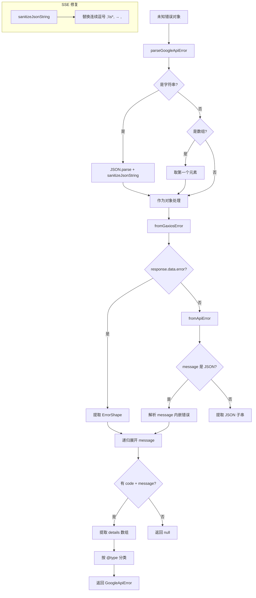

# googleErrors.ts

> 解析 Google API 结构化错误响应，支持多种错误格式和嵌套错误对象的递归展开

## 概述
`googleErrors.ts` 是 Google API 错误处理的核心解析器，能够从多种错误格式（标准 Google API 错误、Gaxios 错误、字符串化嵌套错误等）中提取结构化的错误信息（`GoogleApiError`）。该文件基于 `google/rpc/error_details.proto` 定义了完整的错误详情类型系统，并处理了 SSE 流解析中可能出现的 JSON 损坏问题。在模块中它是错误分类链的第一环，为下游的 `googleQuotaErrors.ts` 提供解析后的结构化数据。

## 架构图

## 主要导出

### 接口/类型
- **`ErrorInfo`** — 错误信息（含 reason、domain、metadata）
- **`RetryInfo`** — 重试信息（含 retryDelay）
- **`DebugInfo`** — 调试信息（含 stackEntries、detail）
- **`QuotaFailure`** — 配额失败（含 violations 数组）
- **`PreconditionFailure`** — 前置条件失败
- **`LocalizedMessage`** — 本地化消息
- **`BadRequest`** — 错误请求（含 fieldViolations）
- **`RequestInfo`** — 请求信息
- **`ResourceInfo`** — 资源信息
- **`Help`** — 帮助链接
- **`GoogleApiErrorDetail`** — 所有错误详情类型的联合类型
- **`GoogleApiError`** — 结构化 Google API 错误 `{ code, message, details }`

### 函数
- **`parseGoogleApiError(error: unknown): GoogleApiError | null`** — 从任意错误对象中解析 Google API 结构化错误

## 核心逻辑
1. **SSE JSON 修复**：`sanitizeJsonString` 通过循环替换修复流解析注入的连续逗号（如 `"field",\n ,"next"` → `"field", "next"`）。
2. **多格式适配**：支持三种错误格式——(a) Gaxios 错误（`response.data.error`），(b) API 错误（`message` 字段内嵌 JSON），(c) 直接的 `{code, message, details}` 对象。
3. **递归展开**：`message` 字段可能包含字符串化的嵌套错误对象，`parseGoogleApiError` 最多递归展开 10 层。
4. **健壮的 JSON 解析**：`fromApiError` 在标准 JSON.parse 失败后，尝试提取字符串中第一个 `{` 到最后一个 `}` 之间的子串再次解析。
5. **@type 分类**：错误详情按 `@type` 字段（如 `type.googleapis.com/google.rpc.ErrorInfo`）分类，处理了 SSE 可能导致的 key 前后空白。

## 内部依赖
无

## 外部依赖
无
