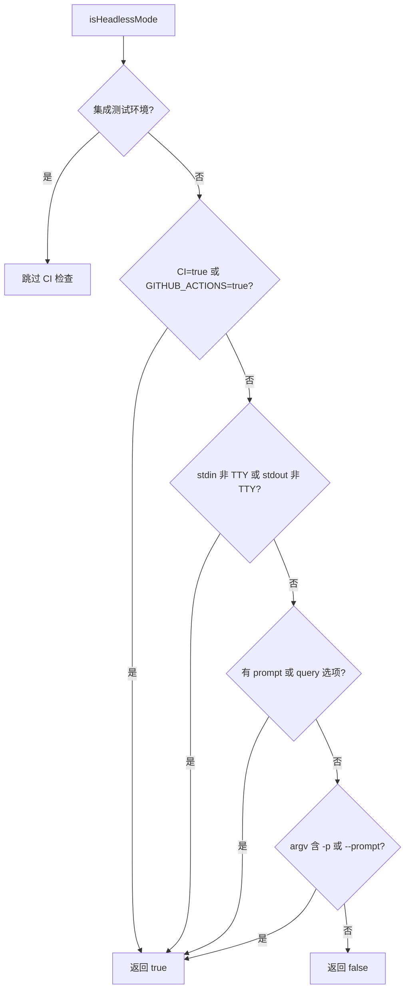

# headless.ts

> 检测 CLI 是否运行在无头（非交互式）模式下

## 概述
`headless.ts` 提供了一个简单但关键的环境检测函数，用于判断 CLI 是否在非交互式环境中运行（如 CI/CD 流水线、管道传输或脚本调用）。该检测结果影响 CLI 的行为模式——无头模式下不显示交互式提示、进度条等 UI 元素。

## 架构图

## 主要导出

### 接口
- **`HeadlessModeOptions`** — 无头模式检测选项 `{ prompt?: string | boolean, query?: string | boolean }`

### 函数
- **`isHeadlessMode(options?: HeadlessModeOptions): boolean`** — 检测是否为无头模式

## 核心逻辑
按优先级检测五种无头信号：
1. `CI=true` 或 `GITHUB_ACTIONS=true`（但 `GEMINI_CLI_INTEGRATION_TEST=true` 时跳过此检查）
2. stdin 或 stdout 非 TTY
3. 传入了 `prompt` 选项
4. 传入了 `query` 选项
5. `process.argv` 中包含 `-p` 或 `--prompt` 标志

## 内部依赖
无

## 外部依赖
- `node:process` — 进程环境和 TTY 检测
