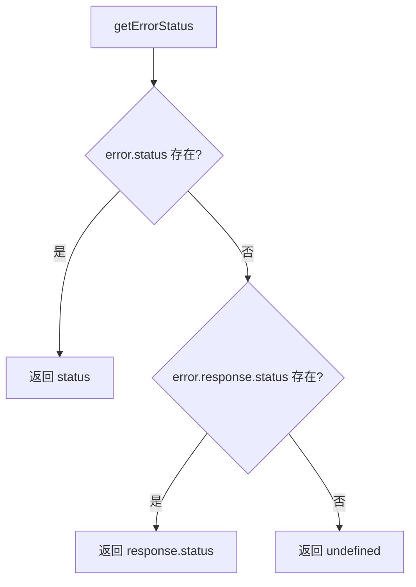

# httpErrors.ts

> 提供 HTTP 错误状态码提取和模型未找到错误类

## 概述
`httpErrors.ts` 是一个精简的 HTTP 错误处理工具文件，提供从各种错误对象（标准错误、Axios 风格错误等）中提取 HTTP 状态码的能力，以及 `ModelNotFoundError` 错误类。该文件在模块中作为 HTTP 错误处理的基础层，被 `googleQuotaErrors.ts` 等上层错误分类器依赖。

## 架构图

## 主要导出

### 接口
- **`HttpError extends Error`** — HTTP 错误接口，包含可选的 `status` 字段

### 类
- **`ModelNotFoundError extends Error`** — 模型未找到错误，默认 `code: 404`

### 函数
- **`getErrorStatus(error: unknown): number | undefined`** — 从错误对象中提取 HTTP 状态码，支持直接的 `error.status` 和嵌套的 `error.response.status`（Axios 风格）

## 核心逻辑
- `getErrorStatus` 使用防御性类型检查逐层访问 `status` 属性，兼容多种错误对象格式。
- `ModelNotFoundError` 是一个简单的带 `code` 字段的 Error 子类。

## 内部依赖
无

## 外部依赖
无
