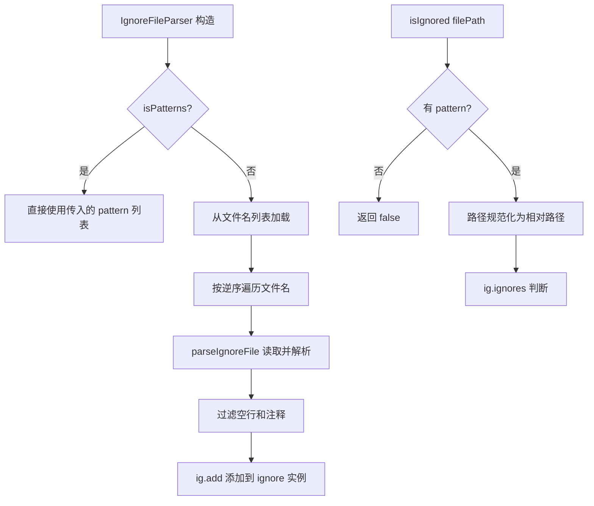

# ignoreFileParser.ts

> 通用忽略文件解析器，从项目根目录加载 .geminiignore 等忽略文件的模式规则

## 概述
`ignoreFileParser.ts` 实现了一个通用的忽略文件解析器（`IgnoreFileParser`），与 `gitIgnoreParser.ts` 不同，它专注于从项目根目录的特定文件（如 `.geminiignore`）中加载扁平化的忽略模式。其设计动机是为非 Git 特有的忽略规则提供统一的解析和匹配能力。该文件在模块中与 `GitIgnoreParser` 互补，共同构成文件过滤的完整方案。

## 架构图

## 主要导出

### 接口
- **`IgnoreFileFilter`** — 忽略文件过滤器接口，定义 `isIgnored`、`getPatterns`、`getIgnoreFilePaths`、`hasPatterns` 方法

### 类
- **`IgnoreFileParser implements IgnoreFileFilter`** — 通用忽略文件解析器
  - **`constructor(projectRoot, input, isPatterns?)`** — `input` 可以是文件名列表或模式列表（由 `isPatterns` 标志控制）
  - **`isIgnored(filePath: string): boolean`** — 判断文件是否被忽略
  - **`getPatterns(): string[]`** — 获取所有已加载的模式
  - **`getIgnoreFilePaths(): string[]`** — 获取实际存在的忽略文件路径
  - **`hasPatterns(): boolean`** — 是否有加载的模式

## 核心逻辑
1. **双模式构造**：构造函数支持两种模式——`isPatterns=false`（默认）从文件加载，`isPatterns=true` 直接使用传入的模式字符串。
2. **文件优先级**：多个文件按逆序处理（`reverse()`），使列表中靠前的文件具有更高优先级（后添加的规则覆盖先前的）。
3. **路径安全检查**：`isIgnored` 进行多重防御——空路径、反斜杠开头、根路径、null 字符、相对路径越界等情况均返回 false。
4. **跨平台**：路径统一转换为正斜杠后交给 `ignore` 库处理。

## 内部依赖
- `./debugLogger.js` — 调试日志

## 外部依赖
- `ignore` — gitignore 模式匹配引擎
- `node:fs` — 同步文件读取
- `node:path` — 路径操作
