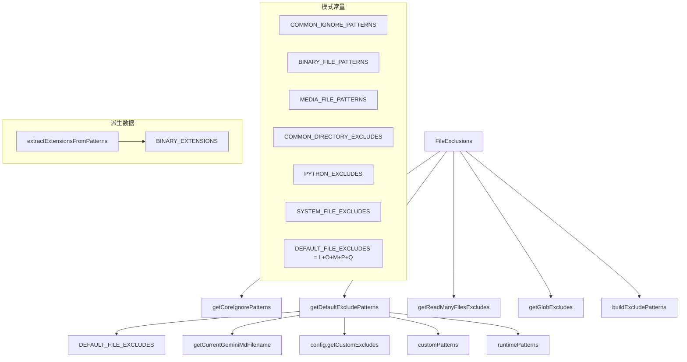

# ignorePatterns.ts

> 定义和管理文件排除模式，提供可配置的 FileExclusions 类和模式常量集合

## 概述
`ignorePatterns.ts` 是文件排除系统的"数据层"和"策略层"，定义了各类文件排除模式常量（通用目录、二进制文件、媒体文件、Python 文件、系统文件等），并通过 `FileExclusions` 类提供可配置、可扩展的排除模式获取接口。该文件在模块中作为 glob 操作和 read-many-files 工具的排除规则中心。

## 架构图

## 主要导出

### 常量
- **`COMMON_IGNORE_PATTERNS`** — 通用忽略目录（node_modules、.git 等）
- **`BINARY_FILE_PATTERNS`** — 二进制文件 glob 模式（.bin、.exe、.zip 等）
- **`MEDIA_FILE_PATTERNS`** — 媒体文件 glob 模式（.pdf、.png、.jpg 等）
- **`COMMON_DIRECTORY_EXCLUDES`** — 通用排除目录（.vscode、dist、build 等）
- **`PYTHON_EXCLUDES`** — Python 排除模式（.pyc、.pyo）
- **`SYSTEM_FILE_EXCLUDES`** — 系统文件排除（.DS_Store、.env）
- **`DEFAULT_FILE_EXCLUDES`** — 综合排除模式（以上所有合并）
- **`BINARY_EXTENSIONS`** — 二进制文件扩展名数组（从模式中提取 + 额外扩展名）

### 类
- **`FileExclusions`** — 可配置的文件排除管理器
  - **`getCoreIgnorePatterns(): string[]`** — 获取核心忽略模式
  - **`getDefaultExcludePatterns(options?): string[]`** — 获取完整默认排除模式
  - **`getReadManyFilesExcludes(additionalExcludes?): string[]`** — read-many-files 专用
  - **`getGlobExcludes(additionalExcludes?): string[]`** — glob 专用
  - **`buildExcludePatterns(options): string[]`** — 自定义构建

### 函数
- **`extractExtensionsFromPatterns(patterns: string[]): string[]`** — 从 glob 模式中提取文件扩展名（支持花括号展开）

### 接口
- **`ExcludeOptions`** — 排除选项 `{ includeDefaults?, customPatterns?, runtimePatterns?, includeDynamicPatterns? }`

## 核心逻辑
1. **模式分层**：排除模式分为 core（最小集）、default（完整集）、runtime（用户传入）、config（配置文件）四层，按需组合。
2. **动态模式**：`includeDynamicPatterns` 控制是否添加当前 GEMINI.md 文件名到排除列表。
3. **扩展名提取**：`extractExtensionsFromPatterns` 处理简单模式（`*.exe`）和花括号展开（`*.{jpg,png}`），使用 `path.extname` 确保正确提取。

## 内部依赖
- `../config/config.js` — `Config` 类型
- `../tools/memoryTool.js` — `getCurrentGeminiMdFilename` 获取当前 GEMINI.md 文件名

## 外部依赖
- `node:path` — 扩展名提取
