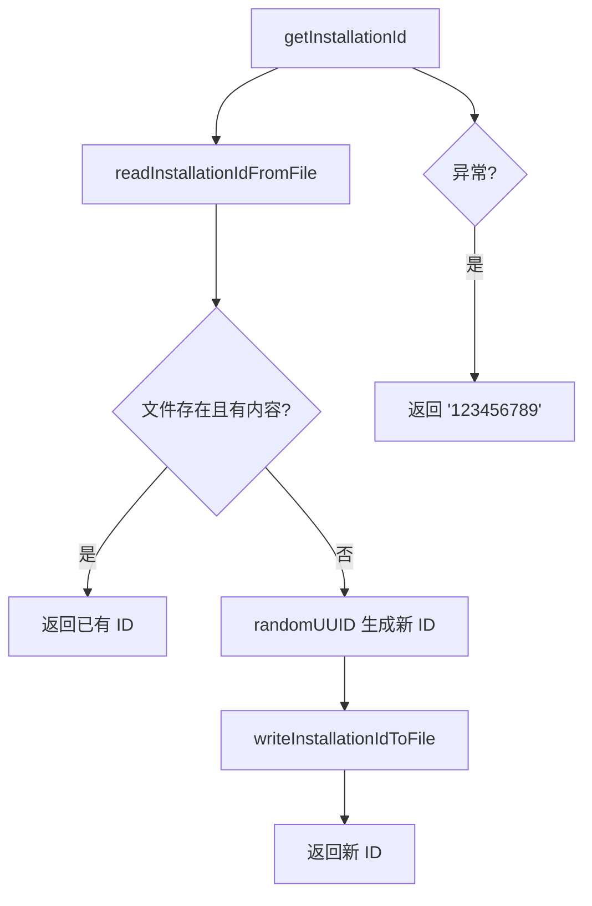

# installationManager.ts

> 管理唯一安装标识符（Installation ID）的持久化存储和检索

## 概述
`installationManager.ts` 提供了 `InstallationManager` 类，负责生成、持久化和检索 CLI 的唯一安装标识符（UUID）。该 ID 用于遥测和安装跟踪目的，存储在用户配置目录中的专用文件里。首次调用时自动生成并写入磁盘，后续调用从文件读取。当文件 I/O 失败时返回硬编码的备用 ID。

## 架构图

## 主要导出

### 类
- **`InstallationManager`** — 安装 ID 管理器
  - **`getInstallationId(): string`** — 获取或创建安装 ID（UUID 格式），异常时返回 `'123456789'`

## 核心逻辑
1. **惰性初始化**：首次调用 `getInstallationId` 时检查文件是否存在，不存在则生成新 UUID 并写入。
2. **路径委托**：安装 ID 文件路径通过 `Storage.getInstallationIdPath()` 获取。
3. **自动创建目录**：`writeInstallationIdToFile` 使用 `fs.mkdirSync({ recursive: true })` 确保父目录存在。
4. **容错**：文件 I/O 异常时返回硬编码 fallback ID `'123456789'`，确保遥测系统不会因此崩溃。

## 内部依赖
- `../config/storage.js` — `Storage.getInstallationIdPath()` 获取存储路径
- `./debugLogger.js` — 调试日志

## 外部依赖
- `node:fs` — 文件读写
- `node:crypto` — `randomUUID` 生成 UUID
- `node:path` — 路径操作
