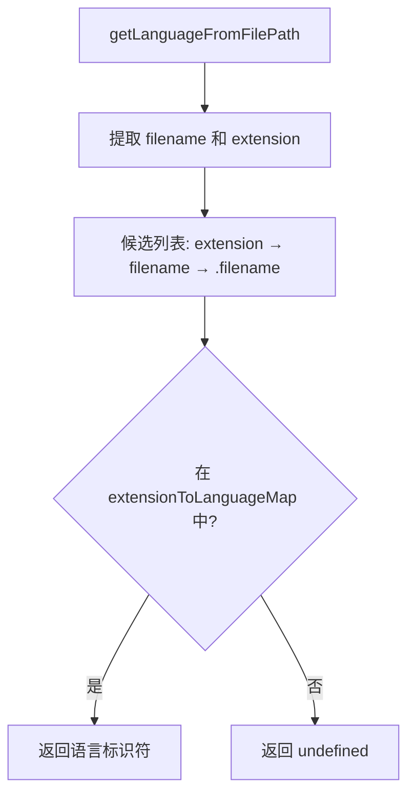

# language-detection.ts

> 根据文件扩展名或文件名检测编程语言标识符（LSP 3.18 规范）

## 概述
`language-detection.ts` 提供了一个文件路径到 LSP（Language Server Protocol）3.18 语言标识符的映射函数。该映射覆盖了 70+ 种文件扩展名和特殊文件名，涵盖主流编程语言、标记语言、配置文件格式等。该文件在模块中用于为编辑工具和代码高亮提供语言类型信息。

## 架构图

## 主要导出

### 函数
- **`getLanguageFromFilePath(filePath: string): string | undefined`** — 从文件路径检测语言标识符

## 核心逻辑
1. **候选优先级**：按三个候选项依次查找映射表——(a) 标准扩展名（如 `.js`），(b) 完整文件名（如 `dockerfile`），(c) 点前缀文件名（如 `.gitignore`）。
2. **映射表**：`extensionToLanguageMap` 是一个扁平的 `{ [key: string]: string }` 对象，键为小写扩展名或文件名，值为 LSP 语言标识符。
3. **特殊处理**：`.prettierrc`、`.eslintrc`、`.babelrc`、`.tsconfig` 映射为 `json`；`.dockerignore`、`.gitignore`、`.npmignore` 映射为 `ignore`。

## 内部依赖
无

## 外部依赖
- `node:path` — `basename` 和 `extname` 提取文件名和扩展名
