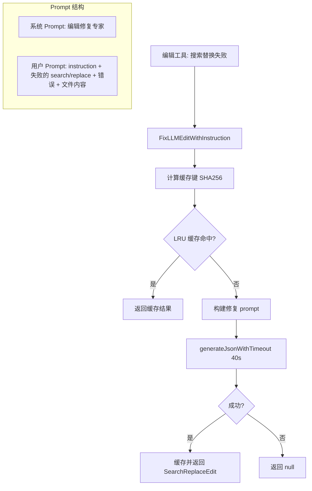

# llm-edit-fixer.ts

> 使用 LLM 自动修复失败的搜索-替换编辑操作

## 概述
`llm-edit-fixer.ts` 实现了一个智能编辑修复机制：当工具执行的搜索-替换操作失败时（通常因为 search 字符串与文件内容不完全匹配），该模块调用专用 LLM 模型分析失败原因并生成修正后的搜索字符串。其设计动机是提高编辑工具的容错率——LLM 生成的 search 字符串可能存在空白、缩进或上下文差异，修复器通过对比实际文件内容来纠正这些偏差。

## 架构图

## 主要导出

### 接口
- **`SearchReplaceEdit`** — 修复结果 `{ search, replace, noChangesRequired, explanation }`

### 函数
- **`FixLLMEditWithInstruction(instruction, old_string, new_string, error, current_content, baseLlmClient, abortSignal): Promise<SearchReplaceEdit | null>`** — 核心修复函数，使用 LLM 生成修正后的搜索-替换对
- **`resetLlmEditFixerCaches_TEST_ONLY(): void`** — 测试专用的缓存清理函数

## 核心逻辑
1. **系统 Prompt 设计**：明确指示 LLM 作为"代码编辑调试专家"，强调最小化修正（不重新发明编辑）、保持 replace 不变、精确匹配文件内容、检测变更已存在的情况。
2. **结构化输出**：使用 `generateJson` 配合 JSON Schema 强制 LLM 返回 `{ search, replace, noChangesRequired, explanation }` 结构。
3. **LRU 缓存**：使用 `mnemonist.LRUCache`（容量 50），缓存键为所有输入参数的 SHA256 哈希，避免对相同失败重复调用 LLM。
4. **超时保护**：`generateJsonWithTimeout` 使用 `AbortSignal.any` 组合外部 signal 和 40 秒超时 signal，超时返回 null。
5. **noChangesRequired 场景**：当 LLM 发现 replace 内容已经存在于文件中时，设置该标志，上层工具可据此跳过编辑。

## 内部依赖
- `../core/baseLlmClient.js` — `BaseLlmClient` LLM 客户端接口
- `./promptIdContext.js` — `getPromptIdWithFallback` 获取 prompt ID
- `./debugLogger.js` — 调试日志
- `../telemetry/types.js` — `LlmRole` 枚举

## 外部依赖
- `node:crypto` — SHA256 哈希计算
- `@google/genai` — `Content`、`Type` 类型
- `mnemonist` — `LRUCache` 缓存实现
