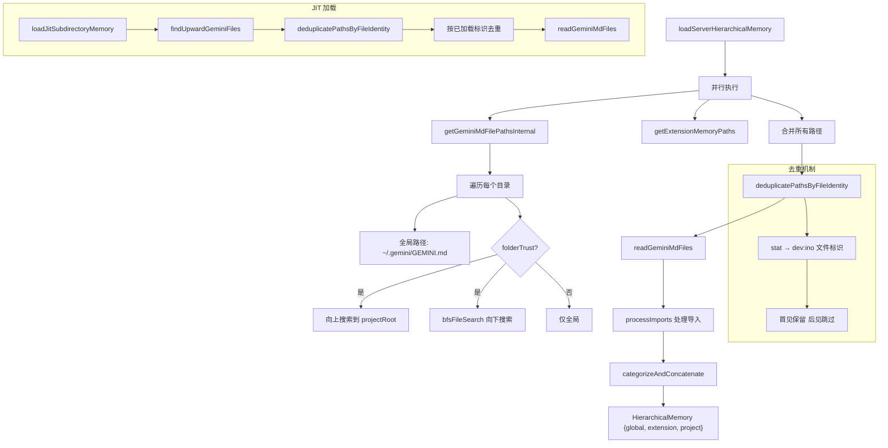

# memoryDiscovery.ts

> GEMINI.md 记忆文件的发现、读取、去重和层次化加载系统

## 概述
`memoryDiscovery.ts` 是记忆系统的核心发现引擎（约 847 行），负责在文件系统中定位所有 GEMINI.md 文件（全局、项目、扩展三个层级），读取并处理导入语句，最终将内容组织为层次化的记忆结构。其设计动机是让 CLI 能够从多个位置自动加载上下文指令，支持全局配置（`~/.gemini/GEMINI.md`）、项目级别（向上/向下搜索）和扩展注入。该文件在模块中作为记忆加载的"主编排器"，是 `Config` 初始化和记忆刷新的关键依赖。

## 架构图

## 主要导出

### 接口
- **`GeminiFileContent`** — `{ filePath: string, content: string | null }`
- **`MemoryLoadResult`** — `{ files: Array<{path, content}>, fileIdentities?: string[] }`
- **`LoadServerHierarchicalMemoryResponse`** — `{ memoryContent: HierarchicalMemory, fileCount: number, filePaths: string[] }`

### 函数
- **`deduplicatePathsByFileIdentity(filePaths: string[]): Promise<{ paths, identityMap }>`** — 基于文件标识（dev:ino）去重，处理大小写不敏感文件系统
- **`readGeminiMdFiles(filePaths, importFormat?): Promise<GeminiFileContent[]>`** — 并发读取文件并处理导入语句
- **`concatenateInstructions(contents, cwdForDisplay): string`** — 将多个文件内容拼接为带标记的指令文本
- **`getGlobalMemoryPaths(): Promise<string[]>`** — 获取全局记忆文件路径
- **`getExtensionMemoryPaths(extensionLoader): string[]`** — 获取扩展提供的记忆文件路径
- **`getEnvironmentMemoryPaths(trustedRoots): Promise<string[]>`** — 获取环境级记忆文件路径（信任根向上遍历）
- **`categorizeAndConcatenate(paths, contentsMap, workingDir): HierarchicalMemory`** — 按类别（global/extension/project）分类并拼接
- **`loadServerHierarchicalMemory(cwd, includeDirs, fileService, extensionLoader, folderTrust, ...): Promise<LoadServerHierarchicalMemoryResponse>`** — 主加载函数，执行完整的发现-读取-分类流程
- **`refreshServerHierarchicalMemory(config): Promise`** — 刷新记忆并更新 Config 状态
- **`loadJitSubdirectoryMemory(targetPath, trustedRoots, alreadyLoadedPaths, alreadyLoadedIdentities?): Promise<MemoryLoadResult>`** — JIT（即时）加载子目录记忆文件

## 核心逻辑
1. **三级记忆层次**：Global（`~/.gemini/GEMINI.md`）→ Extension（扩展注入）→ Project（项目目录树中的 GEMINI.md）。
2. **文件标识去重**：`deduplicatePathsByFileIdentity` 使用 `fs.stat` 获取 `dev:ino` 组合作为文件唯一标识，解决大小写不敏感文件系统（如 macOS）下相同文件有不同路径的问题。批量 stat 限制并发为 20。
3. **双向搜索**：项目级别先向上搜索到项目根（`findProjectRoot` 找 `.git`），再向下 BFS 搜索子目录（`bfsFileSearch`）。
4. **导入处理**：`readGeminiMdFiles` 对每个文件调用 `processImports` 处理 `@path` 导入语句，支持 flat 和 tree 两种格式。
5. **并发控制**：所有并行操作（目录搜索、文件读取、stat 调用）都使用 `CONCURRENT_LIMIT`（10-20）防止 EMFILE 错误。
6. **JIT 加载**：`loadJitSubdirectoryMemory` 支持运行时按需加载新目录的记忆文件，通过已加载路径集合和文件标识集合进行增量去重。
7. **Home 目录保护**：当 CWD 是 Home 目录时，跳过工作区搜索，仅加载全局记忆。
8. **MCP 指令合并**：`refreshServerHierarchicalMemory` 将 MCP 客户端的指令追加到 project 记忆中。

## 内部依赖
- `./bfsFileSearch.js` — BFS 文件搜索
- `../tools/memoryTool.js` — `getAllGeminiMdFilenames` 获取所有 GEMINI.md 文件名变体
- `../services/fileDiscoveryService.js` — `FileDiscoveryService` 文件发现服务
- `./memoryImportProcessor.js` — `processImports` 导入处理
- `../config/constants.js` — `DEFAULT_MEMORY_FILE_FILTERING_OPTIONS`、`FileFilteringOptions`
- `./paths.js` — `GEMINI_DIR`、`homedir`、`normalizePath`
- `./extensionLoader.js` — `ExtensionLoader` 类型
- `./debugLogger.js` — 调试日志
- `../config/config.js` — `Config` 类型
- `../config/memory.js` — `HierarchicalMemory` 类型
- `./events.js` — `CoreEvent`、`coreEvents` 事件系统
- `./errors.js` — `getErrorMessage`

## 外部依赖
- `node:fs/promises` — 异步文件操作
- `node:fs` — 同步常量（`constants.R_OK`）
- `node:path` — 路径操作
