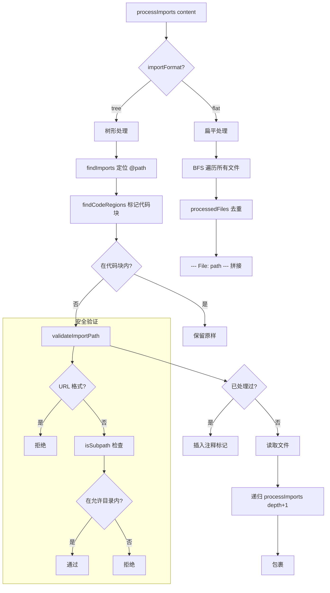

# memoryImportProcessor.ts

> 处理 GEMINI.md 文件中的 @path 导入语句，支持递归导入、循环检测和路径安全验证

## 概述
`memoryImportProcessor.ts` 实现了 GEMINI.md 记忆文件的导入系统，允许用户通过 `@path/to/file` 语法在记忆文件中引用其他文件的内容。该处理器支持递归导入（最大深度 5 层）、循环引用检测、代码块内导入语句的忽略，以及路径遍历攻击的防护。它提供 `tree`（嵌套 HTML 注释标记）和 `flat`（去重拼接）两种输出格式。

## 架构图

## 主要导出

### 接口
- **`MemoryFile`** — 导入树节点 `{ path: string, imports?: MemoryFile[] }`
- **`ProcessImportsResult`** — 处理结果 `{ content: string, importTree: MemoryFile }`

### 函数
- **`processImports(content, basePath, debugMode?, importState?, projectRoot?, importFormat?): Promise<ProcessImportsResult>`** — 核心导入处理函数
- **`validateImportPath(importPath, basePath, allowedDirectories): boolean`** — 验证导入路径是否在允许的目录范围内

## 核心逻辑
1. **导入语法解析**：`findImports` 手写解析器扫描 `@` 字符，提取到空白/换行为止的路径，验证首字符（`.`、`/` 或字母）。
2. **代码块保护**：`findCodeRegions` 使用正则匹配反引号代码块/内联代码区域，在代码块内的 `@path` 不作为导入处理。
3. **树形格式**（tree）：递归处理导入，用 HTML 注释 `<!-- Imported from: ... -->` 包裹导入内容，维护 `processedFiles` Set 检测循环引用。
4. **扁平格式**（flat）：使用 BFS 遍历所有文件（包括递归导入），全局 `processedFiles` 去重，最终以 `--- File: path ---` 标记拼接。
5. **安全措施**：(a) 最大递归深度 5；(b) `validateImportPath` 拒绝 URL 格式（`file://`、`http://`）；(c) `isSubpath` 确保解析后的路径在项目根目录内。
6. **项目根查找**：如果未提供 `projectRoot`，通过向上查找 `.git` 目录自动确定。

## 内部依赖
- `./paths.js` — `isSubpath` 路径包含检查
- `./debugLogger.js` — 调试日志

## 外部依赖
- `node:fs/promises` — 异步文件读取
- `node:path` — 路径解析和规范化
