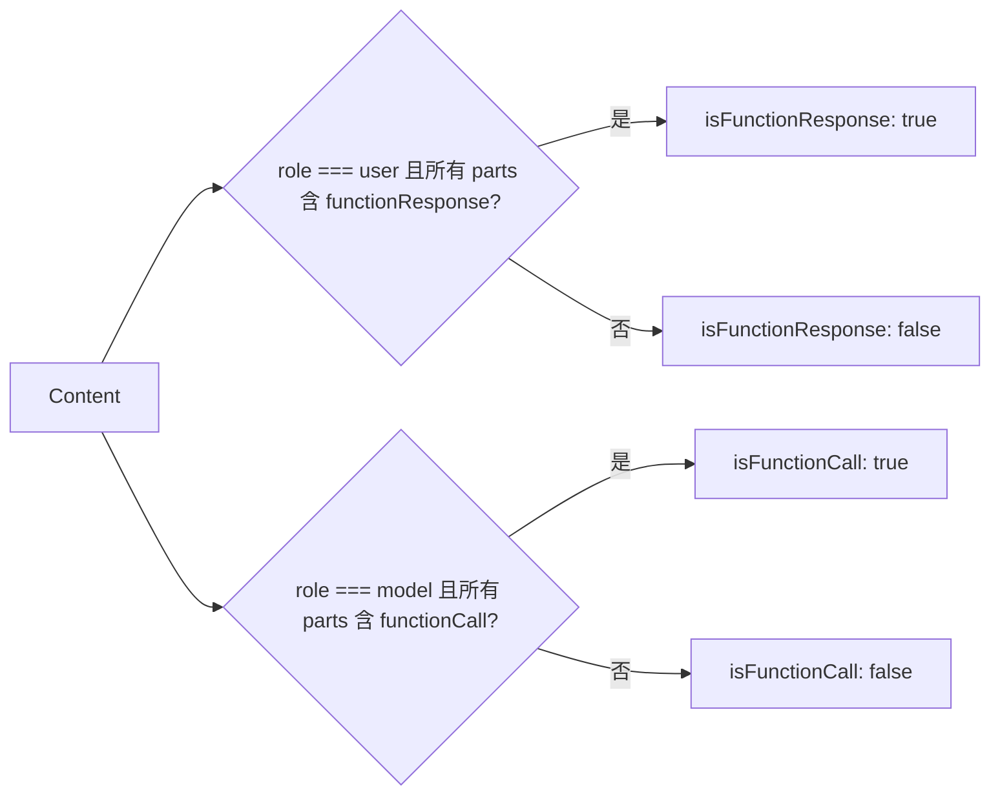

# messageInspectors.ts

> 提供 Gemini API 消息内容的类型检查工具函数

## 概述
`messageInspectors.ts` 提供了两个精简的类型检查函数，用于判断 Gemini API 的 `Content` 对象是函数响应消息还是函数调用消息。该文件在模块中作为消息类型判断的基础工具，被聊天流程控制（如 `nextSpeakerChecker.ts`）和对话历史管理所依赖。

## 架构图

## 主要导出

### 函数
- **`isFunctionResponse(content: Content): boolean`** — 判断消息是否为函数响应（role=user 且所有 parts 都有 functionResponse）
- **`isFunctionCall(content: Content): boolean`** — 判断消息是否为函数调用（role=model 且所有 parts 都有 functionCall）

## 核心逻辑
- 两个函数检查三个条件：(a) 角色匹配（user/model），(b) parts 非空，(c) 所有 parts 都包含目标字段。使用 `Array.every` 确保是纯粹的函数响应/调用消息。

## 内部依赖
无

## 外部依赖
- `@google/genai` — `Content` 类型
