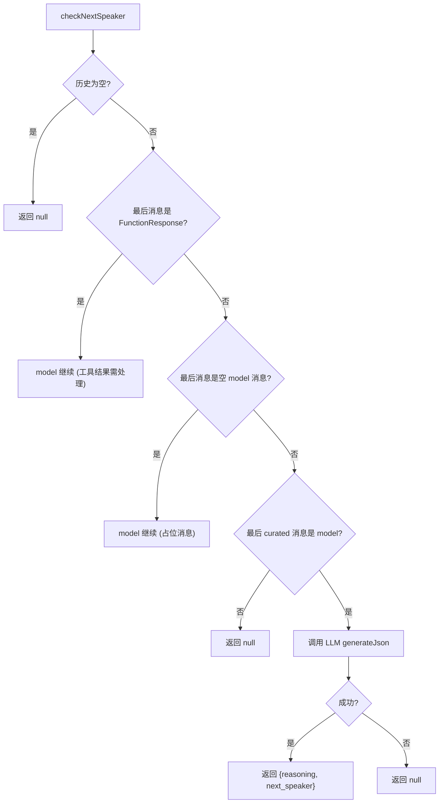

# nextSpeakerChecker.ts

> 使用 LLM 判断对话中下一步应由用户还是模型发言

## 概述
`nextSpeakerChecker.ts` 实现了一个对话流程控制机制，通过分析对话历史中模型的最后一条响应，判断接下来应该由用户输入还是模型继续生成。其设计动机是解决多轮工具调用中的"谁应该说话"问题——模型可能因为工具调用结果需要继续处理，也可能已经完成任务等待用户反馈。该文件在模块中作为对话循环的"交通调度员"。

## 架构图

## 主要导出

### 接口
- **`NextSpeakerResponse`** — `{ reasoning: string, next_speaker: 'user' | 'model' }`

### 函数
- **`checkNextSpeaker(chat: GeminiChat, baseLlmClient: BaseLlmClient, abortSignal: AbortSignal, promptId: string): Promise<NextSpeakerResponse | null>`** — 判断下一个发言者

## 核心逻辑
1. **快速路径判断**：在调用 LLM 之前，先进行两个快速检查——(a) 最后消息是 FunctionResponse，模型必须继续处理；(b) 最后消息是空的 model 消息（占位符），模型应继续。
2. **LLM 判断**：将 curated 历史加上判断 prompt 发送给 `next-speaker-checker` 模型，要求返回结构化 JSON `{ reasoning, next_speaker }`。
3. **判断规则**（prompt 中定义）：
   - **模型继续**：上一响应明确表示要执行下一步操作或响应不完整
   - **用户回复**：上一响应以问题结尾
   - **用户回复**：上一响应完成了一个完整的思路/任务
4. **双重历史**：使用 curated history（过滤无效 turn）作为 LLM 输入，使用 comprehensive history 进行快速路径判断。

## 内部依赖
- `./messageInspectors.js` — `isFunctionResponse` 消息类型检查
- `./debugLogger.js` — 调试日志
- `../core/baseLlmClient.js` — `BaseLlmClient` 类型
- `../core/geminiChat.js` — `GeminiChat` 类型
- `../telemetry/types.js` — `LlmRole` 枚举

## 外部依赖
- `@google/genai` — `Content` 类型
