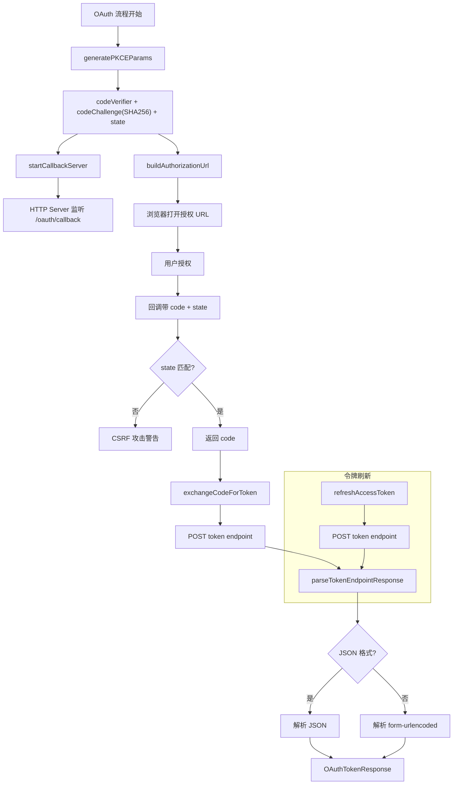

# oauth-flow.ts

> 实现 OAuth 2.0 授权码流程的共享基础设施，支持 PKCE 和本地回调服务器

## 概述
`oauth-flow.ts` 提供了协议无关的 OAuth 2.0 授权码流程原语，包括 PKCE（Proof Key for Code Exchange）参数生成、本地 HTTP 回调服务器、授权 URL 构建、授权码换取令牌和令牌刷新。该文件的设计动机是将 OAuth 流程的通用部分从特定的认证提供者（MCP OAuth、A2A OAuth）中抽离，实现代码复用。约 520 行，涵盖了完整的 OAuth 2.0 + PKCE 客户端实现。

## 架构图

## 主要导出

### 接口
- **`OAuthFlowConfig`** — OAuth 配置 `{ clientId, clientSecret?, authorizationUrl, tokenUrl, scopes?, audiences?, redirectUri? }`
- **`OAuthRefreshConfig`** — 刷新配置（`OAuthFlowConfig` 的子集）
- **`PKCEParams`** — PKCE 参数 `{ codeVerifier, codeChallenge, state }`
- **`OAuthAuthorizationResponse`** — 授权响应 `{ code, state }`
- **`OAuthTokenResponse`** — 令牌响应 `{ access_token, token_type, expires_in?, refresh_token?, scope? }`

### 常量
- **`REDIRECT_PATH`**: `'/oauth/callback'` — 回调路径

### 函数
- **`generatePKCEParams(): PKCEParams`** — 生成 PKCE 参数（64 字节 verifier + SHA256 challenge + 16 字节 state）
- **`startCallbackServer(expectedState, port?): { port: Promise<number>, response: Promise<OAuthAuthorizationResponse> }`** — 启动本地 HTTP 回调服务器
- **`getPortFromUrl(urlString?): number | undefined`** — 从 URL 中提取端口号
- **`buildAuthorizationUrl(config, pkceParams, redirectPort, resource?): string`** — 构建完整的授权 URL
- **`exchangeCodeForToken(config, code, codeVerifier, redirectPort, resource?): Promise<OAuthTokenResponse>`** — 用授权码换取令牌
- **`refreshAccessToken(config, refreshToken, tokenUrl, resource?): Promise<OAuthTokenResponse>`** — 刷新访问令牌

## 核心逻辑
1. **PKCE 安全**：使用 64 字节随机数生成 code_verifier（base64url 编码约 86 字符），SHA256 哈希生成 code_challenge，16 字节随机 state 防 CSRF。
2. **回调服务器**：
   - 支持三种端口来源：环境变量 `OAUTH_CALLBACK_PORT` > 参数 `port` > OS 自动分配（0）
   - 返回两个 Promise：`port`（服务器启动后立即解析）和 `response`（收到有效回调后解析）
   - 5 分钟超时自动关闭
   - HTML 响应中对错误信息进行 XSS 转义
   - state 不匹配时拒绝（CSRF 防护）
3. **令牌端点解析**（`parseTokenEndpointResponse`）：
   - 优先尝试 JSON 解析，回退到 form-urlencoded 解析
   - 非 200 响应时尝试从 form-urlencoded 中提取错误信息
   - 对非标准 Content-Type 输出警告日志
4. **RFC 8707 支持**：`buildAuthorizationUrl`、`exchangeCodeForToken`、`refreshAccessToken` 均支持可选的 `resource` 参数。
5. **audience 支持**：配置中的 `audiences` 数组在授权和令牌请求中均以空格分隔传递。

## 内部依赖
- `./debugLogger.js` — 调试日志

## 外部依赖
- `node:http` — HTTP 服务器
- `node:crypto` — 随机字节和 SHA256 哈希
- `node:net` — `AddressInfo` 类型
- `node:url` — `URL` 类
