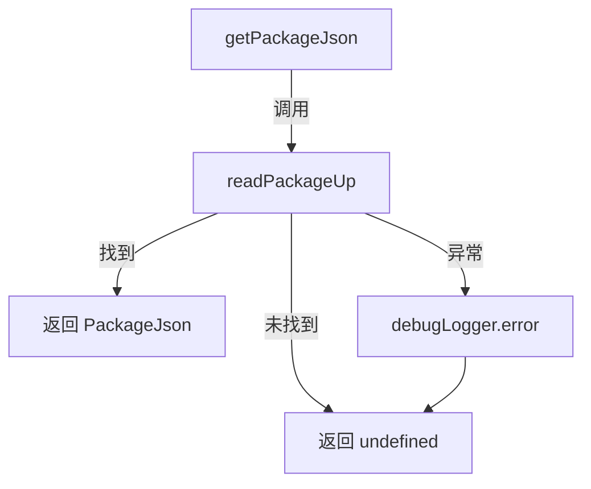

# package.ts

> 从项目目录层级中读取并解析 `package.json` 文件

## 概述
该文件提供了一个向上查找 `package.json` 的工具函数。它封装了 `read-package-up` 库的功能，用于从指定目录开始向父级目录逐层搜索 `package.json`，并返回解析后的内容。在 Gemini CLI 中，该函数主要用于获取项目版本号、沙箱镜像配置等元数据信息。设计上对非 Node.js 项目目录（找不到 `package.json`）做了优雅降级处理，返回 `undefined` 而非抛出异常。

## 架构图

## 主要导出

### `type PackageJson`
- **签名**: `type PackageJson = BasePackageJson & { config?: { sandboxImageUri?: string } }`
- **用途**: 扩展了基础 `PackageJson` 类型，增加了 `config.sandboxImageUri` 可选字段，用于指定沙箱容器镜像地址。

### `function getPackageJson(cwd: string): Promise<PackageJson | undefined>`
- **签名**: `async function getPackageJson(cwd: string): Promise<PackageJson | undefined>`
- **用途**: 从指定目录开始向上查找 `package.json`。若找到则返回解析后的对象，否则返回 `undefined`。异常时通过 `debugLogger` 记录错误并安全返回 `undefined`。

## 核心逻辑
1. 调用 `readPackageUp({ cwd, normalize: false })` 执行向上搜索，`normalize: false` 避免字段名规范化以保留原始内容。
2. 若结果为空（未找到文件），直接返回 `undefined`。
3. 通过 `try-catch` 捕获任何读取/解析异常，记录日志后返回 `undefined`。

## 内部依赖
- `./debugLogger.js` -- 用于错误日志记录

## 外部依赖
- `read-package-up` -- 核心库，提供向上查找并解析 `package.json` 的能力
