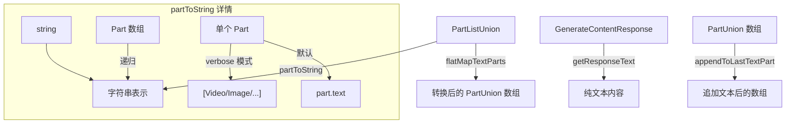

# partUtils.ts

> Gemini API 多模态内容部件（Part）的转换与操作工具集

## 概述
该文件提供了一组处理 Gemini API `Part` 和 `PartListUnion` 类型的实用函数。在 Gemini CLI 的多模态对话流中，模型的输入和输出涉及文本、图片、函数调用等多种 Part 类型。本文件负责将这些混合类型统一转换为字符串表示、提取响应文本、对文本部分进行异步转换，以及在提示词末尾追加内容。它是核心对话处理管线中不可或缺的底层工具模块。

## 架构图

## 主要导出

### `function partToString(value: PartListUnion, options?: { verbose?: boolean }): string`
- **用途**: 将 `PartListUnion`（字符串、Part 数组或单个 Part）转换为字符串。`verbose` 模式下会为非文本部件生成摘要描述（如 `[Image: image/png, 12.5 KB]`、`[Function Call: toolName]`）。

### `function getResponseText(response: GenerateContentResponse): string | null`
- **用途**: 从 `GenerateContentResponse` 中提取纯文本内容，过滤掉 `thought` 类型的部件。返回拼接后的文本或 `null`。

### `function flatMapTextParts(parts: PartListUnion, transform: (text: string) => Promise<PartUnion[]>): Promise<PartUnion[]>`
- **用途**: 对 `PartListUnion` 中的每个文本部件执行异步转换函数，非文本部件原样保留。用于对提示词中的文本内容进行批量变换。

### `function appendToLastTextPart(prompt: PartUnion[], textToAppend: string, separator?: string): PartUnion[]`
- **用途**: 在提示词数组的最后一个文本部件末尾追加文本。若最后一个部件不是文本类型，则新增一个文本部件。

## 核心逻辑
- `partToString`: 递归处理数组类型，对单个 Part 依次检查 `videoMetadata`、`thought`、`codeExecutionResult`、`executableCode`、`fileData`、`functionCall`、`functionResponse`、`inlineData` 等字段，在 verbose 模式下返回对应的描述文本。
- `getResponseText`: 从 `candidates[0].content.parts` 中过滤 `!part.thought` 的部件，拼接所有 `text` 字段。
- `flatMapTextParts`: 将输入统一为数组后逐个处理，文本部件调用 `transform`，其余部件直接推入结果。
- `appendToLastTextPart`: 不可变操作，创建新数组后修改最后一个元素。

## 内部依赖
无

## 外部依赖
- `@google/genai` -- 提供 `GenerateContentResponse`、`PartListUnion`、`Part`、`PartUnion` 类型定义
