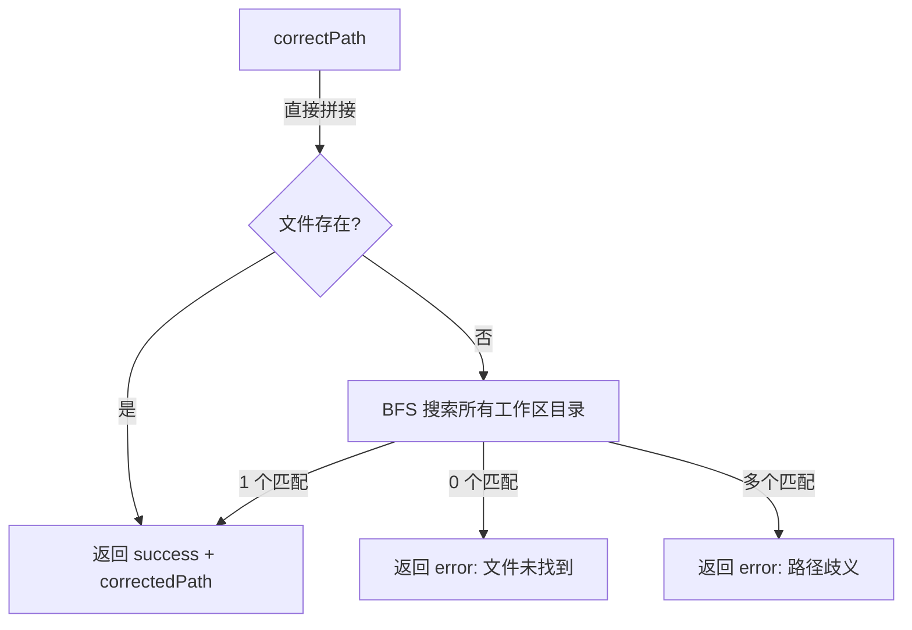

# pathCorrector.ts

> 将相对或模糊文件路径纠正为工作区内的唯一绝对路径

## 概述
该文件实现了文件路径纠正逻辑。当 LLM 或用户提供的路径不是绝对路径时，`correctPath` 函数会尝试在工作区目录中查找匹配的文件。它首先检查目标目录下的直接相对路径，若未找到则通过 BFS 广度优先搜索在所有工作区目录中查找同名文件。若匹配唯一则返回纠正后的绝对路径，若存在多个匹配则提示歧义，若无匹配则报告未找到。此机制确保工具在处理 LLM 输出的可能不完整路径时具备容错能力。

## 架构图

## 主要导出

### `type PathCorrectionResult`
- **签名**: `SuccessfulPathCorrection | FailedPathCorrection`
- **用途**: 联合类型，成功时含 `correctedPath`，失败时含 `error` 描述。

### `function correctPath(filePath: string, config: Config): PathCorrectionResult`
- **用途**: 将相对/模糊路径纠正为唯一绝对路径。先尝试直接拼接目标目录，再进行 BFS 搜索。

## 核心逻辑
1. 将 `filePath` 与 `config.getTargetDir()` 拼接，若文件存在则直接返回。
2. 获取工作区所有目录 (`workspaceContext.getDirectories()`)。
3. 提取 `filePath` 的 basename，在各目录中调用 `bfsFileSearchSync` 搜索同名文件（限制最多遍历 50 个目录）。
4. 过滤结果，只保留路径末尾与 `filePath` 匹配的文件。
5. 根据匹配数量（0/1/多个）返回对应结果。

## 内部依赖
- `../config/config.js` -- `Config` 类型
- `./bfsFileSearch.js` -- `bfsFileSearchSync` 广度优先文件搜索

## 外部依赖
- `node:fs` -- 文件存在性检查
- `node:path` -- 路径拼接与解析
