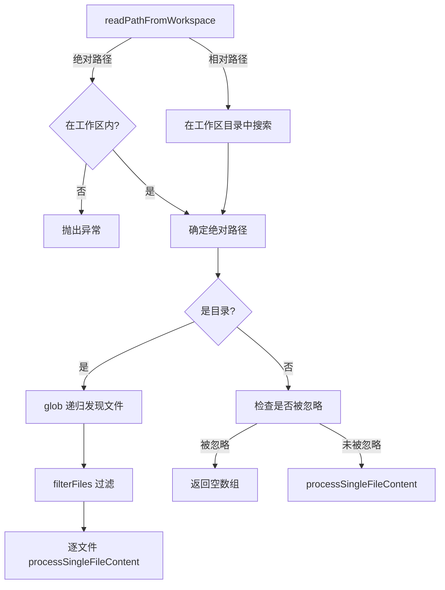

# pathReader.ts

> 从工作区读取文件或递归展开目录内容，生成适合 LLM 输入的多模态数据

## 概述
该文件提供了 `readPathFromWorkspace` 函数，负责将工作区内的文件或目录路径转换为 LLM 可消费的 `PartUnion[]` 内容。对于单个文件，直接处理其内容；对于目录，则递归发现所有子文件并逐一处理。路径解析支持绝对路径和相对路径，并严格校验路径必须位于工作区范围内。文件发现过程尊重 `.gitignore` 和 `.geminiignore` 规则进行过滤。

## 架构图

## 主要导出

### `function readPathFromWorkspace(pathStr: string, config: Config): Promise<PartUnion[]>`
- **用途**: 读取工作区中指定路径的内容。支持文件和目录，返回 LLM 可用的 `PartUnion` 数组。绝对路径须在工作区内，相对路径在所有工作区目录中按优先级搜索。

## 核心逻辑
1. **路径解析**: 绝对路径直接校验是否在工作区内；相对路径在 `workspace.getDirectories()` 中逐个尝试 `fs.access` 查找首个存在的路径。
2. **目录处理**: 使用 `glob('**/*')` 递归发现文件，通过 `fileService.filterFiles` 过滤，最后对每个文件调用 `processSingleFileContent` 生成内容。
3. **文件处理**: 先检查文件是否被忽略规则排除，未被排除则调用 `processSingleFileContent` 处理。
4. 目录输出包含 `--- Start/End of content for directory ---` 标记。

## 内部依赖
- `./fileUtils.js` -- `processSingleFileContent` 文件内容处理
- `../config/config.js` -- `Config` 配置对象

## 外部依赖
- `node:fs/promises` -- 异步文件操作
- `node:path` -- 路径处理
- `glob` -- 递归文件发现
- `@google/genai` -- `PartUnion` 类型
