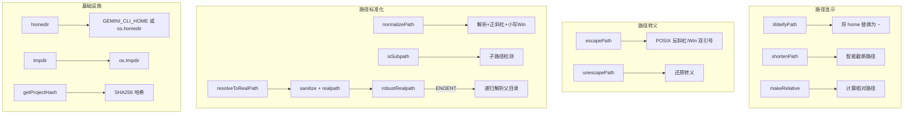

# paths.ts

> 跨平台路径操作工具集：缩短、转义、规范化、子路径检测与符号链接解析

## 概述
该文件是 Gemini CLI 路径处理的核心工具模块，约 420 行代码，提供了丰富的路径操作函数。主要功能包括：获取主目录（支持 `GEMINI_CLI_HOME` 环境变量覆盖）、路径波浪号化、智能路径缩短（保留首尾目录段）、相对路径计算、跨平台路径转义/反转义（用于 `@` 命令）、项目哈希生成、路径规范化比较、子路径检测，以及健壮的符号链接解析。该模块被整个项目广泛依赖，是文件操作和显示层的基础设施。

## 架构图

## 主要导出

### `const GEMINI_DIR = '.gemini'`
- **用途**: Gemini CLI 配置目录名常量。

### `const GOOGLE_ACCOUNTS_FILENAME = 'google_accounts.json'`
- **用途**: Google 账户缓存文件名常量。

### `function homedir(): string`
- **用途**: 返回主目录路径，优先使用 `GEMINI_CLI_HOME` 环境变量。

### `function tmpdir(): string`
- **用途**: 返回操作系统临时目录路径。

### `function tildeifyPath(path: string): string`
- **用途**: 将以主目录开头的路径替换为 `~` 前缀，用于简化显示。

### `function shortenPath(filePath: string, maxLen?: number): string`
- **用途**: 智能缩短过长路径。保留首段目录和末尾文件名，中间用 `...` 连接。支持多种截断模式（start/end/center），优先保留末尾段完整性。默认最大长度 35 字符。

### `function makeRelative(targetPath: string, rootDirectory: string): string`
- **用途**: 计算从根目录到目标路径的相对路径。若目标已是相对路径则原样返回；同一目录返回 `'.'`。

### `function escapePath(filePath: string): string`
- **用途**: 为 `@` 命令转义路径。Windows 使用双引号包裹，POSIX 使用反斜杠转义特殊字符。

### `function unescapePath(filePath: string): string`
- **用途**: `escapePath` 的逆操作，还原路径转义。

### `function getProjectHash(projectRoot: string): string`
- **用途**: 基于项目根路径生成 SHA256 哈希，用于唯一标识项目。

### `function normalizePath(p: string): string`
- **用途**: 路径规范化：解析绝对路径、统一为正斜杠、Windows 下转小写，用于跨平台路径比较。

### `function isSubpath(parentPath: string, childPath: string): boolean`
- **用途**: 检测 `childPath` 是否是 `parentPath` 的子路径。支持跨平台。

### `function resolveToRealPath(pathStr: string): string`
- **用途**: 健壮的路径解析：移除 `file://` 协议、解码 URI 编码、解析符号链接。内部使用 `robustRealpath` 处理 ENOENT 情况（递归解析父目录）。

## 核心逻辑
- **shortenPath**: 解析路径段后尝试保留首段和尽可能多的尾段，使用预算分配算法（优先缩减非末尾段）将总长度控制在 `maxLen` 内。多级 fallback 策略确保任何情况都能产出合法结果。
- **robustRealpath**: 当 `fs.realpathSync` 遇到 ENOENT（路径不存在）时，检查是否为符号链接并递归解析；否则递归解析父目录并拼接 basename。使用 `visited` 集合检测循环引用。

## 内部依赖
无

## 外部依赖
- `node:path` -- 路径操作
- `node:os` -- 主目录和临时目录
- `node:crypto` -- SHA256 哈希
- `node:fs` -- 文件系统操作（realpathSync、lstatSync、readlinkSync）
- `node:url` -- `fileURLToPath` URI 转换
