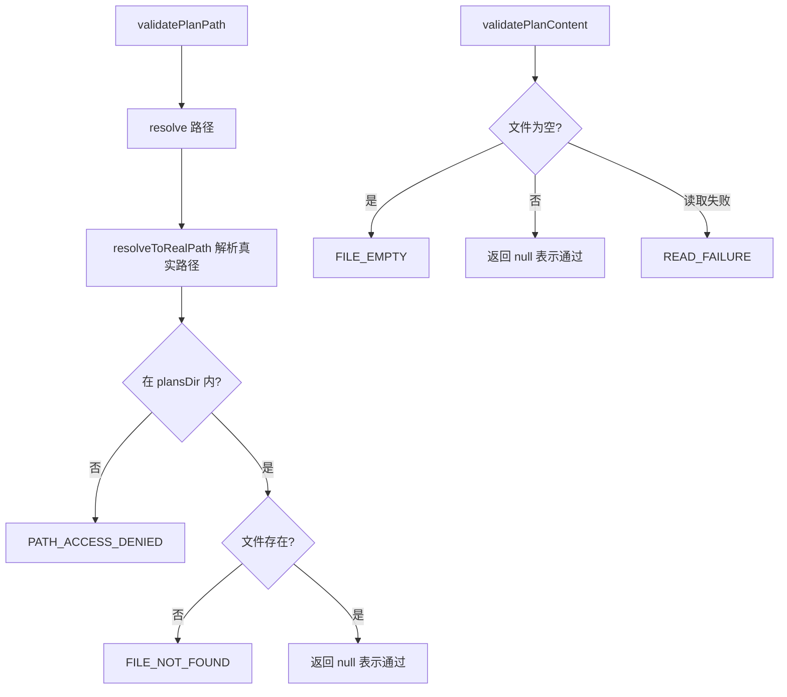

# planUtils.ts

> 计划（Plan）文件路径安全校验与内容验证工具

## 概述
该文件为计划审批工作流提供路径安全校验和内容验证功能。在 Gemini CLI 的计划模式（Plan Mode）中，LLM 会生成计划文件，用户需审批后执行。本模块确保计划文件路径不会发生目录穿越攻击（必须位于指定的 plans 目录内），且文件内容非空。标准化的错误消息被后端工具和 CLI UI 共享，保证一致的用户体验。

## 架构图

## 主要导出

### `const PlanErrorMessages`
- **用途**: 标准化错误消息对象，包含 `PATH_ACCESS_DENIED`、`FILE_NOT_FOUND(path)`、`FILE_EMPTY`、`READ_FAILURE(detail)`。被后端和 CLI 前端共享。

### `function validatePlanPath(planPath: string, plansDir: string, targetDir: string): Promise<string | null>`
- **用途**: 验证计划文件路径的安全性。检查路径是否在授权的 plans 目录内（防止目录穿越）以及文件是否存在。通过返回 `null`，失败返回错误消息。

### `function validatePlanContent(planPath: string): Promise<string | null>`
- **用途**: 验证计划文件内容是否非空。通过返回 `null`，空文件或读取失败返回错误消息。

## 核心逻辑
- `validatePlanPath`: 使用 `path.resolve` 和 `resolveToRealPath` 将路径解析为真实绝对路径后，通过 `isSubpath` 校验是否在 plans 目录范围内。
- `validatePlanContent`: 调用 `isEmpty` 检查文件是否为空。

## 内部依赖
- `./fileUtils.js` -- `isEmpty`、`fileExists` 函数
- `./paths.js` -- `isSubpath`、`resolveToRealPath` 路径工具

## 外部依赖
- `node:path` -- 路径解析
