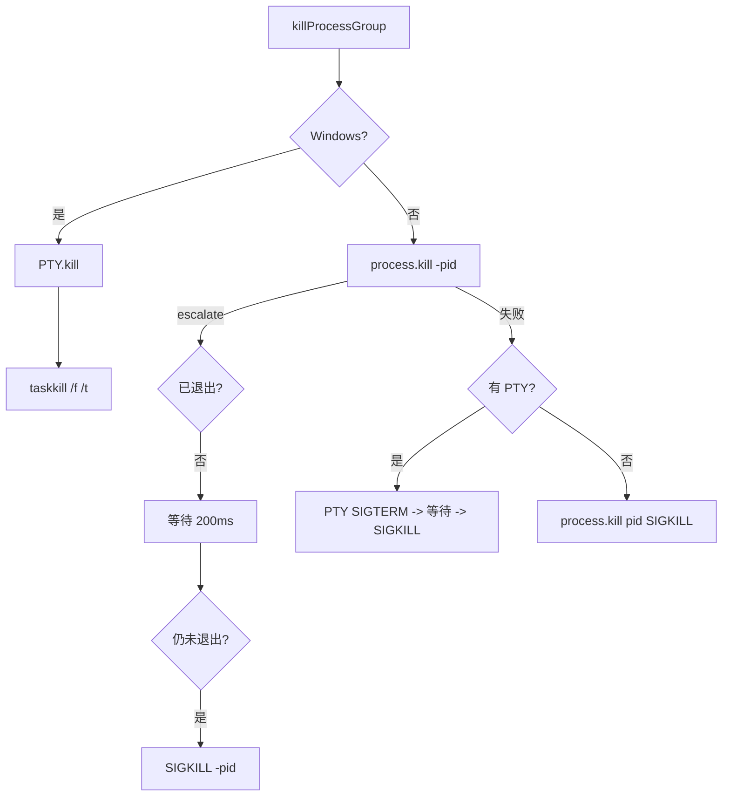

# process-utils.ts

> 跨平台进程组终止工具，支持信号升级和 PTY 会话

## 概述
该文件提供了健壮的跨平台进程终止功能。在 Gemini CLI 中，Shell 工具执行的外部命令可能产生子进程树，普通的 `process.kill` 无法可靠地终止整个进程树。本模块通过平台检测采用不同的终止策略：Windows 上使用 `taskkill /f /t` 终止整个进程树；Unix 上使用进程组 kill（`-pid`），并支持从 SIGTERM 到 SIGKILL 的信号升级。同时支持 PTY（伪终端）场景的特殊处理。

## 架构图

## 主要导出

### `const SIGKILL_TIMEOUT_MS = 200`
- **用途**: SIGTERM 升级为 SIGKILL 前的等待时间（毫秒）。

### `interface KillOptions`
- **用途**: 进程终止配置，包含 `pid`、`escalate`（是否升级信号）、`signal`（初始信号）、`isExited`（退出状态回调）、`pty`（PTY 对象）。

### `function killProcessGroup(options: KillOptions): Promise<void>`
- **用途**: 健壮地终止进程或进程组。Windows 使用 `taskkill`，Unix 使用进程组 kill，支持信号升级。

## 核心逻辑
1. **Windows**: 先尝试 PTY 的 kill 方法，再调用 `taskkill /pid PID /f /t` 强制终止整个进程树。
2. **Unix**:
   - 使用 `process.kill(-pid, signal)` 终止进程组。
   - 若 `escalate` 为 true，先发 SIGTERM，等待 200ms 后检查，未退出则发 SIGKILL。
   - 若进程组 kill 失败，fallback 到对特定 PID 的 kill 或 PTY 的 kill。
3. 所有 kill 调用都被 try-catch 包裹，忽略已退出进程的错误。

## 内部依赖
- `./shell-utils.js` -- `spawnAsync` 用于执行 `taskkill`

## 外部依赖
- `node:os` -- 平台检测
