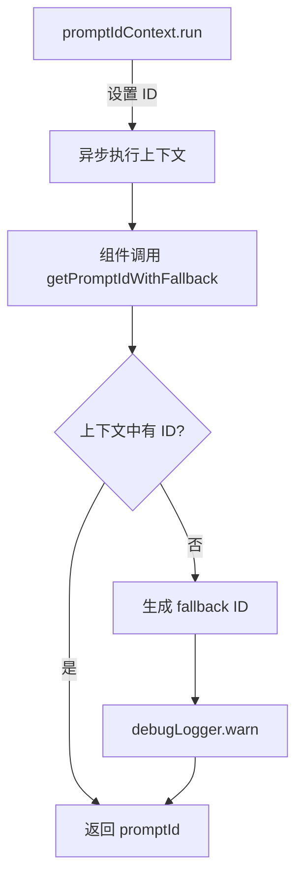

# promptIdContext.ts

> 基于 AsyncLocalStorage 的提示词 ID 上下文管理

## 概述
该文件利用 Node.js 的 `AsyncLocalStorage` 机制，为每次提示词（Prompt）执行提供一个全局可访问的唯一 ID 上下文。在异步调用链中，各组件可以通过 `promptIdContext.getStore()` 获取当前提示词的 ID，无需通过参数逐层传递。若上下文中找不到 ID（不应发生的异常情况），会生成一个带组件名前缀的 fallback ID 并记录警告。

## 架构图

## 主要导出

### `const promptIdContext: AsyncLocalStorage<string>`
- **用途**: `AsyncLocalStorage` 实例，存储当前提示词 ID。由上层在提示词处理开始时调用 `.run(id, fn)` 设置。

### `function getPromptIdWithFallback(componentName: string): string`
- **用途**: 从上下文获取提示词 ID。若不存在，则生成格式为 `{componentName}-fallback-{timestamp}-{random}` 的备用 ID 并发出警告。

## 核心逻辑
- 使用 `AsyncLocalStorage` 的 `getStore()` 方法获取当前异步上下文中的提示词 ID。
- Fallback ID 包含组件名、时间戳和随机十六进制字符串，确保唯一性。

## 内部依赖
- `./debugLogger.js` -- 日志记录

## 外部依赖
- `node:async_hooks` -- `AsyncLocalStorage`
