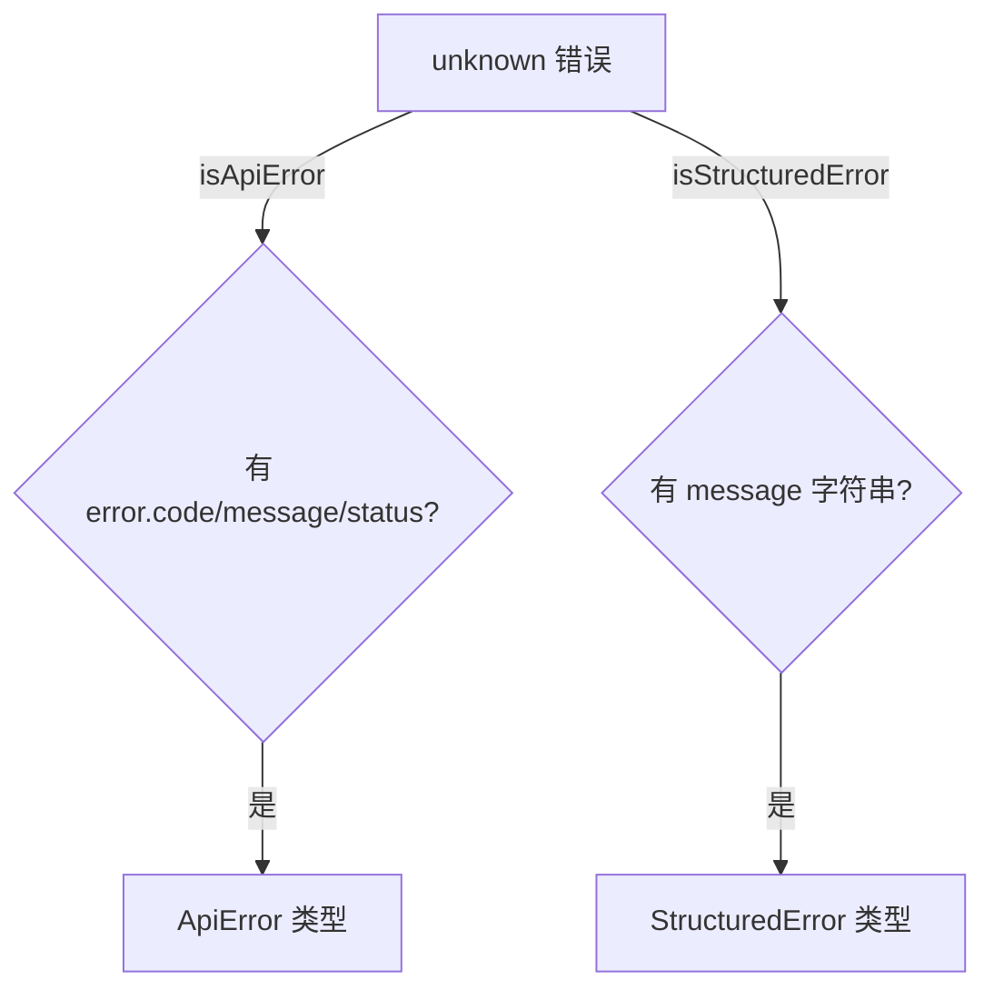

# quotaErrorDetection.ts

> API 错误和结构化错误的类型守卫工具

## 概述
该文件提供了两个类型守卫函数，用于在运行时安全地判断未知错误对象是否符合 `ApiError` 或 `StructuredError` 接口。这些守卫在错误处理管线中被广泛使用，确保在处理 API 响应错误和内部结构化错误时能安全地访问错误属性。

## 架构图

## 主要导出

### `interface ApiError`
- **签名**: `{ error: { code: number; message: string; status: string; details: unknown[] } }`
- **用途**: 描述 API 返回的标准错误格式。

### `function isApiError(error: unknown): error is ApiError`
- **用途**: 类型守卫，检查错误对象是否为 `ApiError` 格式（含 `error` 属性，其中有 `message` 字段）。

### `function isStructuredError(error: unknown): error is StructuredError`
- **用途**: 类型守卫，检查错误对象是否为 `StructuredError` 格式（含字符串类型的 `message` 属性）。

## 核心逻辑
两个函数均使用 `typeof` + `in` 运算符进行运行时类型检查，避免直接类型断言。

## 内部依赖
- `../core/turn.js` -- `StructuredError` 类型

## 外部依赖
无
