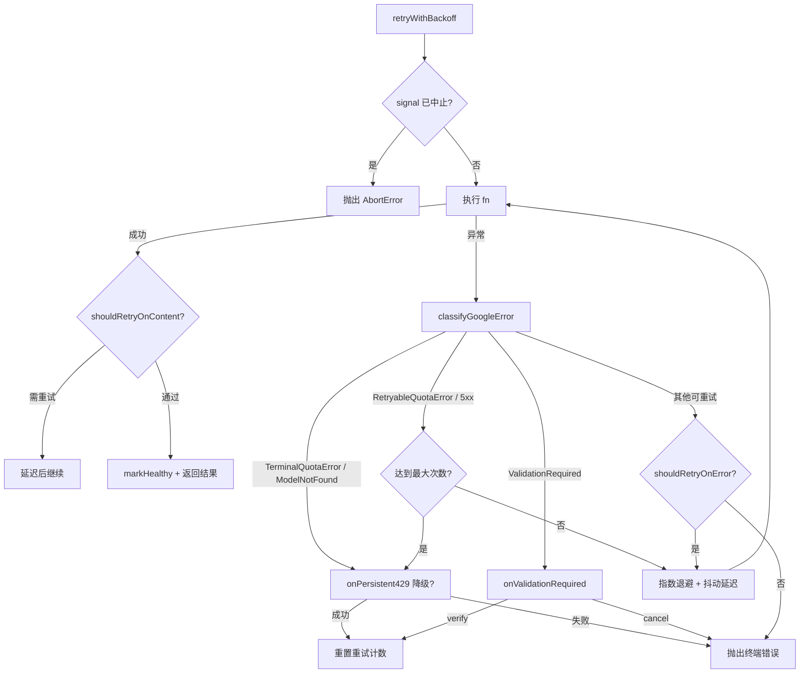

# retry.ts

> 带指数退避和抖动的 API 请求重试引擎，支持配额错误分类、模型降级和验证流程

## 概述
该文件（约 444 行）是 Gemini CLI 与 API 通信的核心弹性层。它实现了一个功能完善的重试框架，支持指数退避（exponential backoff）加随机抖动（jitter），能够智能区分可重试错误（网络错误、429/5xx HTTP 状态码）和终端错误（配额耗尽、模型未找到），并在持续 429 错误时触发模型降级回退。还支持 `ValidationRequiredError` 的交互式验证流程、可中止的 `AbortSignal`、内容级重试（`shouldRetryOnContent`），以及模型健康状态上报。该模块是确保 CLI 在不稳定网络和 API 限流条件下仍能可靠运行的关键组件。

## 架构图

## 主要导出

### `const DEFAULT_MAX_ATTEMPTS = 10`
- **用途**: 默认最大重试次数。

### `interface RetryOptions`
- **用途**: 重试配置，包含 `maxAttempts`、`initialDelayMs`、`maxDelayMs`、`shouldRetryOnError`、`shouldRetryOnContent`、`onPersistent429`（模型降级回调）、`onValidationRequired`（验证回调）、`authType`、`retryFetchErrors`、`signal`（中止信号）、`getAvailabilityContext`（健康状态上报）、`onRetry`（重试事件回调）。

### `function isRetryableError(error: Error | unknown, retryFetchErrors?: boolean): boolean`
- **用途**: 默认的错误可重试判断函数。对网络错误码（ECONNRESET、ETIMEDOUT 等）、429、499、5xx 状态码返回 true。支持 `retryFetchErrors` 开关来重试 fetch 失败和不完整 JSON 错误。

### `function getRetryErrorType(error: unknown): string`
- **用途**: 将错误分类为遥测安全的字符串标签（如 `QUOTA_EXCEEDED`、`SERVER_ERROR`、`FETCH_FAILED`、`INCOMPLETE_JSON` 等），不含 PII。

### `function retryWithBackoff<T>(fn: () => Promise<T>, options?: Partial<RetryOptions>): Promise<T>`
- **用途**: 核心重试函数。使用指数退避加抖动策略重试异步操作。支持配额错误分类、模型降级回退、验证流程、内容级重试和可中止操作。

## 核心逻辑
1. **错误分类**: 使用 `classifyGoogleError` 将原始错误分为 `TerminalQuotaError`、`RetryableQuotaError`、`ValidationRequiredError`、`ModelNotFoundError` 等类型。
2. **退避策略**: `currentDelay` 从 `initialDelayMs` 开始，每次重试翻倍至 `maxDelayMs`。对配额错误使用 +20% 正抖动（尊重服务器要求的最小延迟），对其他错误使用 +/-30% 对称抖动。
3. **模型降级**: 终端配额错误或达到最大重试次数时，调用 `onPersistent429` 回调尝试切换模型。成功后重置重试计数。
4. **验证流程**: `ValidationRequiredError` 时调用 `onValidationRequired`，用户选择验证后重置重试。
5. **健康上报**: 请求成功后通过 `getAvailabilityContext` 获取上下文，调用 `markHealthy` 上报模型可用。
6. **网络错误**: 遍历错误的 `cause` 链（最多 5 层）查找网络错误码。

## 内部依赖
- `./googleQuotaErrors.js` -- 配额错误分类（`TerminalQuotaError`、`RetryableQuotaError`、`ValidationRequiredError`、`classifyGoogleError`）
- `./delay.js` -- `delay`、`createAbortError`
- `./debugLogger.js` -- 日志记录
- `./httpErrors.js` -- `getErrorStatus`、`ModelNotFoundError`
- `../availability/modelPolicy.js` -- `RetryAvailabilityContext` 类型

## 外部依赖
- `@google/genai` -- `ApiError`、`GenerateContentResponse` 类型
