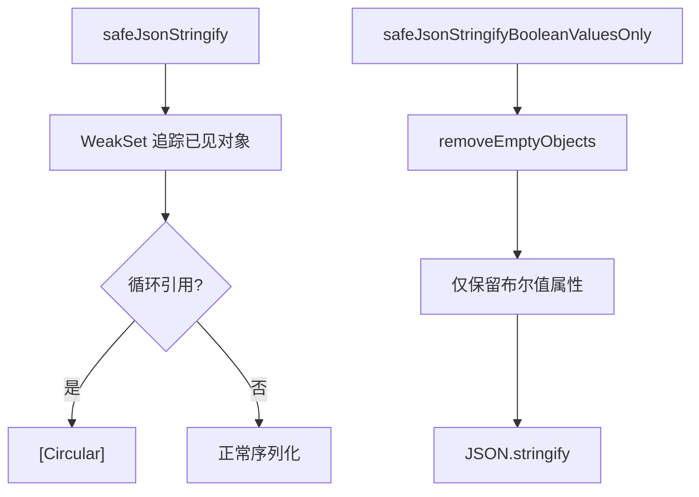

# safeJsonStringify.ts

> 安全的 JSON 序列化工具，处理循环引用和布尔值过滤

## 概述
该文件提供了两个安全的 JSON 序列化函数。`safeJsonStringify` 通过 `WeakSet` 检测并替换循环引用为 `[Circular]`，防止 `JSON.stringify` 抛出异常。`safeJsonStringifyBooleanValuesOnly` 进一步过滤，仅保留布尔值属性，用于安全地序列化配置对象（去除敏感字符串数据）。

## 架构图

## 主要导出

### `function safeJsonStringify(obj: unknown, space?: string | number): string`
- **用途**: 安全地将对象序列化为 JSON 字符串，循环引用被替换为 `[Circular]`。支持可选的格式化参数。

### `function safeJsonStringifyBooleanValuesOnly(obj: any): string`
- **用途**: 序列化对象时仅保留布尔值类型的属性，其他属性值替换为空字符串。用于安全记录配置信息（不泄露敏感数据）。

## 核心逻辑
- `safeJsonStringify`: 使用 `JSON.stringify` 的 replacer 回调，维护 `WeakSet` 记录已遍历的对象。遇到重复引用时返回 `'[Circular]'`。
- `safeJsonStringifyBooleanValuesOnly`: 先通过 `removeEmptyObjects` 预处理只保留布尔值属性，再在 replacer 中对非布尔值返回空字符串。

## 内部依赖
- `../config/config.js` -- `Config` 类型（仅用于类型引用）

## 外部依赖
无
