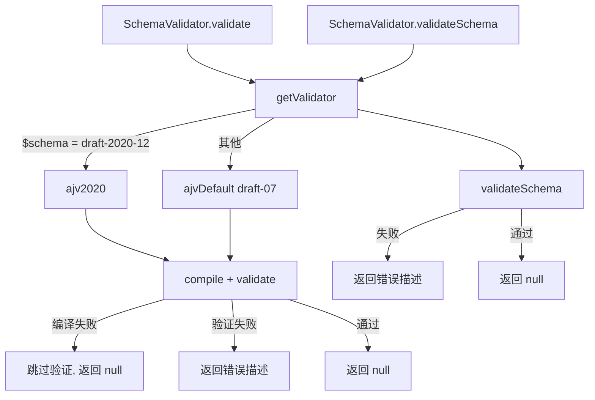

# schemaValidator.ts

> 基于 Ajv 的 JSON Schema 验证器，支持 draft-07 和 draft-2020-12 标准

## 概述
该文件封装了 Ajv JSON Schema 验证库，为 Gemini CLI 提供统一的参数和 Schema 验证能力。它同时维护两个 Ajv 实例：一个用于 draft-07（默认），另一个用于 draft-2020-12（主要用于 rmcp MCP 服务器）。验证器采用宽容策略：当 Schema 编译失败（如不支持的 JSON Schema 版本）时，跳过验证而非阻断工具使用。这与 MCP 客户端中 `LenientJsonSchemaValidator` 的行为保持一致。

## 架构图

## 主要导出

### `class SchemaValidator`
- **静态方法 `validate(schema, data)`**: 验证数据是否符合 Schema。返回 `null` 表示通过，否则返回错误描述字符串。Schema 编译失败时宽容处理（返回 `null`）。
- **静态方法 `validateSchema(schema)`**: 验证 Schema 自身的合法性。返回 `null` 表示合法，否则返回错误描述。

## 核心逻辑
- 根据 Schema 的 `$schema` 字段自动选择对应的 Ajv 实例（`https://json-schema.org/draft/2020-12/schema` 使用 Ajv2020，其余使用默认 Ajv）。
- `strictSchema: false` 允许使用非标准关键字（符合 JSON Schema 规范对未知关键字的忽略策略）。
- Schema 编译失败时记录警告但不阻断，确保工具仍可使用。

## 内部依赖
- `./debugLogger.js` -- 警告日志

## 外部依赖
- `ajv` -- JSON Schema draft-07 验证
- `ajv/dist/2020.js` -- JSON Schema draft-2020-12 验证
- `ajv-formats` -- 标准格式支持（email、uri 等）
