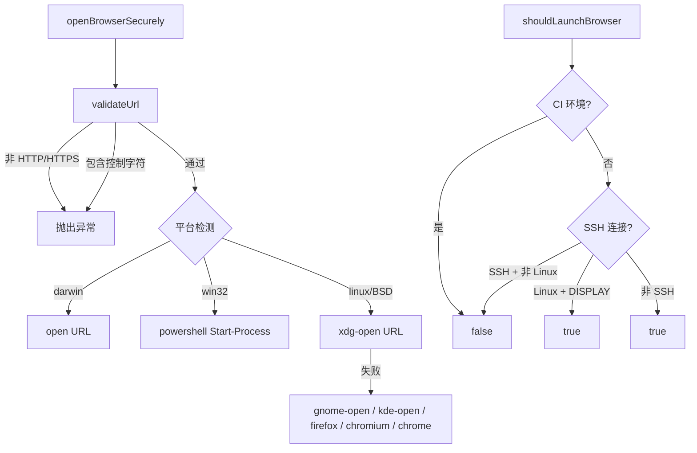

# secure-browser-launcher.ts

> 安全的跨平台浏览器启动器，防止命令注入攻击

## 概述
该文件提供了安全打开浏览器 URL 的功能，是 OAuth 登录和用户引导等场景的基础设施。与常见的 `exec('open URL')` 方式不同，本模块通过多层安全措施防止命令注入：严格验证 URL 协议（仅允许 HTTP/HTTPS）、检测控制字符、使用 `execFile` 而非 `exec` 避免 shell 解释。跨平台支持 macOS（`open`）、Windows（PowerShell `Start-Process`）、Linux（`xdg-open` 及多种备选方案）。还提供了环境检测函数，判断当前是否适合启动浏览器（排除 CI、SSH、无 GUI 环境）。

## 架构图

## 主要导出

### `function openBrowserSecurely(url: string): Promise<void>`
- **用途**: 安全地在默认浏览器中打开 URL。严格验证 URL（仅 HTTP/HTTPS、无控制字符），使用 `execFile` 避免 shell 注入。Linux 平台支持多种浏览器的自动降级。

### `function shouldLaunchBrowser(): boolean`
- **用途**: 检测当前环境是否应尝试启动浏览器。排除 CI 环境、BROWSER 黑名单、SSH 远程会话（Linux 除外，若有 DISPLAY 则允许）。

## 核心逻辑
- **URL 验证**: 使用 `new URL()` 解析，检查 `protocol` 是否为 `http:` 或 `https:`，检测换行和控制字符。
- **跨平台启动**: macOS 用 `open`，Windows 用 PowerShell 的 `Start-Process`（对单引号做转义），Linux 用 `xdg-open` 并有 5 个备选命令。
- **环境检测**: 依次检查 `BROWSER` 黑名单、`CI`/`DEBIAN_FRONTEND` 环境变量、`SSH_CONNECTION`、Linux 显示服务器变量（`DISPLAY`、`WAYLAND_DISPLAY`、`MIR_SOCKET`）。

## 内部依赖
无

## 外部依赖
- `node:child_process` -- `execFile`
- `node:util` -- `promisify`
- `node:os` -- 平台检测
- `node:url` -- URL 解析
