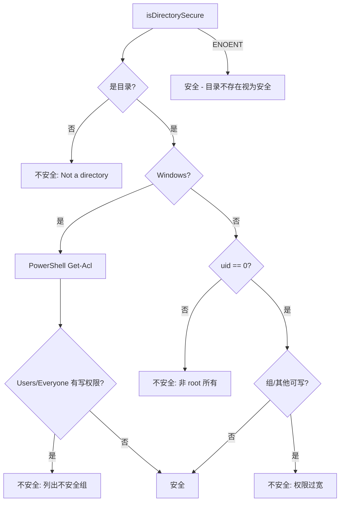

# security.ts

> 目录安全性检查：验证目录所有权和权限是否满足安全要求

## 概述
该文件提供了 `isDirectorySecure` 函数，用于验证关键目录（如系统策略目录）的安全性。在企业部署场景中，策略文件目录必须由 root 拥有且不可被普通用户写入，以防止策略篡改。本模块支持跨平台检查：POSIX 系统检查 uid 为 0 且无组/其他用户写权限；Windows 系统通过 PowerShell 检查 ACL 确保 `Users` 和 `Everyone` 组没有写权限。

## 架构图

## 主要导出

### `interface SecurityCheckResult`
- **签名**: `{ secure: boolean; reason?: string }`
- **用途**: 安全检查结果，`secure` 为 false 时 `reason` 包含详细原因和修复建议。

### `function isDirectorySecure(dirPath: string): Promise<SecurityCheckResult>`
- **用途**: 检查指定目录是否安全（root 拥有、不可被普通用户写入）。返回包含检查结果和修复建议的对象。目录不存在时视为安全。

## 核心逻辑
1. **POSIX**: 通过 `fs.stat` 获取 `uid` 和 `mode`，检查 uid 是否为 0，以及 `S_IWGRP | S_IWOTH` 位是否为零。错误消息包含修复命令（`sudo chown`、`sudo chmod`）。
2. **Windows**: 执行 PowerShell 脚本获取目录 ACL，过滤出具有 Write/Modify/FullControl 权限的 Users 和 Everyone 组。
3. 目录不存在（ENOENT）时返回安全，允许首次运行时策略目录尚未创建。

## 内部依赖
- `./shell-utils.js` -- `spawnAsync` 用于执行 PowerShell

## 外部依赖
- `node:fs/promises` -- 异步文件状态
- `node:fs` -- 权限常量
- `node:os` -- 平台检测
