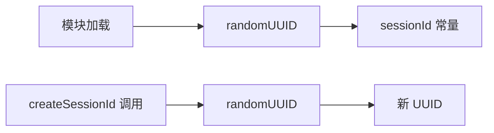

# session.ts

> 会话 ID 生成器，提供全局唯一的 UUID v4 会话标识

## 概述
该文件是一个极简模块，使用 Node.js `crypto.randomUUID()` 生成全局唯一的会话 ID。模块加载时自动生成一个 `sessionId`（作为当前进程的会话标识），同时导出 `createSessionId` 函数用于按需创建新的会话 ID。会话 ID 在遥测、日志记录和状态跟踪中被广泛使用。

## 架构图

## 主要导出

### `const sessionId: string`
- **用途**: 模块级会话 ID 常量，在模块首次加载时生成。标识当前 CLI 进程的整个生命周期。

### `function createSessionId(): string`
- **用途**: 按需创建新的 UUID v4 会话 ID。用于需要独立会话标识的场景（如恢复会话、子会话）。

## 核心逻辑
直接调用 `crypto.randomUUID()` 生成标准 UUID v4。

## 内部依赖
无

## 外部依赖
- `node:crypto` -- `randomUUID`
