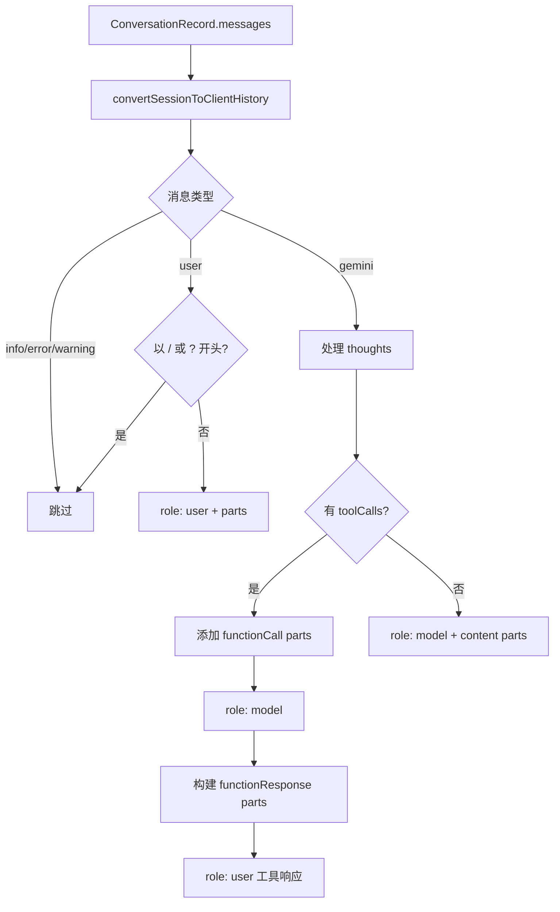

# sessionUtils.ts

> 会话/对话记录到 Gemini 客户端历史格式的转换器

## 概述
该文件负责将 Gemini CLI 内部的对话记录（`ConversationRecord`）转换为 Gemini API 客户端所需的历史消息格式。在会话恢复和上下文传递场景中，需要将之前的对话记录（包含用户消息、模型响应、工具调用及其结果）重新构建为 API 可用的 `{ role, parts }` 数组。转换过程处理了多种复杂情况：思考过程（thoughts）、工具调用/响应、多模态内容、斜杠命令过滤等。

## 架构图

## 主要导出

### `function convertSessionToClientHistory(messages): Array<{ role: 'user' | 'model'; parts: Part[] }>`
- **用途**: 将 CLI 内部对话记录转换为 Gemini API 客户端历史格式。过滤非对话消息（info/error/warning）和命令消息（以 `/` 或 `?` 开头），正确处理工具调用和响应的多轮对话结构。

## 核心逻辑
1. **消息过滤**: 跳过 `info`/`error`/`warning` 类型消息和斜杠命令。
2. **用户消息**: 通过 `ensurePartArray` 将 `PartListUnion` 统一为 `Part[]`。
3. **模型消息**:
   - 先添加 `thoughts`（标记 `thought: true`）。
   - 有工具调用时：先推送包含 content + functionCall 的 model 消息，再构建 functionResponse 的 user 消息。
   - 无工具调用时：直接推送 content 的 model 消息。
4. **工具响应处理**: 支持字符串结果（包装为 `functionResponse`）、数组结果（作为 parts 展开）和 Part 对象结果。

## 内部依赖
- `../services/chatRecordingService.js` -- `ConversationRecord` 类型
- `../core/geminiRequest.js` -- `partListUnionToString` 函数

## 外部依赖
- `@google/genai` -- `Part`、`PartListUnion` 类型
