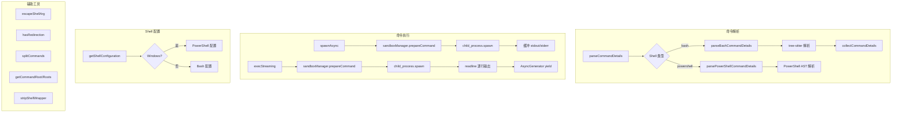

# shell-utils.ts

> 跨平台 Shell 命令解析、执行与安全工具集（~917 行）

## 概述
该文件是 Gemini CLI Shell 工具的核心基础设施，约 917 行代码。它提供了四大功能领域：(1) Shell 命令解析 -- 使用 tree-sitter 进行 Bash 语法树解析，或通过 PowerShell AST 解析 Windows 命令，提取命令名称、检测语法错误和重定向；(2) Shell 配置检测 -- 根据平台和环境自动选择 Bash 或 PowerShell；(3) 命令执行 -- `spawnAsync` 用于缓冲执行，`execStreaming` 用于流式逐行输出的大型命令；(4) 安全工具 -- Shell 参数转义、命令包装剥离等。所有命令执行均支持沙箱模式（通过 `SandboxManager`）。

## 架构图

## 主要导出

### 类型与常量

- **`type ShellType = 'cmd' | 'powershell' | 'bash'`** -- Shell 类型标识
- **`interface ShellConfiguration`** -- Shell 执行配置：`executable`（可执行文件）、`argsPrefix`（参数前缀）、`shell`（类型）
- **`const SHELL_TOOL_NAMES = ['run_shell_command', 'ShellTool']`** -- Shell 工具名称常量

### 解析相关

- **`function initializeShellParsers(): Promise<void>`** -- 初始化 tree-sitter 的 Bash 解析器（加载 WASM 二进制）。失败时不抛出异常，允许降级到正则检查。
- **`function parseCommandDetails(command: string): CommandParseResult | null`** -- 解析命令字符串，返回命令详情列表、语法错误标记和重定向检测。根据平台自动选择 Bash 或 PowerShell 解析器。
- **`function hasRedirection(command: string): boolean`** -- 检测命令是否包含重定向操作符。使用解析器检测，fallback 到正则匹配。
- **`function splitCommands(command: string): string[]`** -- 将链式命令（`&&`、`||`、`;` 连接）拆分为独立命令列表。
- **`function getCommandRoot(command: string): string | undefined`** -- 提取命令的根命令名（如 `git status` 返回 `git`）。
- **`function getCommandRoots(command: string): string[]`** -- 提取所有命令名（排除重定向操作符）。

### 执行相关

- **`function spawnAsync(command, args, options?): Promise<{ stdout, stderr }>`** -- 异步执行命令，缓冲完整的 stdout/stderr。支持沙箱模式。
- **`function execStreaming(command, args, options?): AsyncGenerator<string>`** -- 流式执行命令，通过 AsyncGenerator 逐行 yield stdout。支持 AbortSignal 中止、自定义允许退出码、沙箱模式。stderr 限制 20KB 缓冲。

### 配置与安全

- **`function getShellConfiguration(): ShellConfiguration`** -- 检测当前平台的 Shell 配置。Windows 优先使用 ComSpec 指定的 PowerShell，默认 `powershell.exe`；Unix 系统使用 `bash`。
- **`function escapeShellArg(arg: string, shell: ShellType): string`** -- 根据 Shell 类型安全转义参数。PowerShell 用单引号包裹，cmd 用双引号，Bash 使用 `shell-quote` 库。
- **`function stripShellWrapper(command: string): string`** -- 剥离命令中的 shell 包装（如 `bash -c '...'`），提取实际命令。
- **`function resolveExecutable(exe: string): Promise<string | undefined>`** -- 在 PATH 中查找可执行文件的完整路径。
- **`const isWindows`** -- Windows 平台检测函数。

## 核心逻辑
1. **Bash 解析**: 使用 web-tree-sitter WASM 加载 Bash 语法，解析命令为 AST。通过 DFS 遍历收集所有 `command`、`declaration_command`、`test_command`、`file_redirect`、`heredoc_redirect` 等节点。解析超时限制 1 秒。检测 `@P` prompt 命令变换作为错误标记。
2. **PowerShell 解析**: 通过 `-EncodedCommand` 标志执行 UTF-16LE base64 编码的 PowerShell 脚本，使用 `[System.Management.Automation.Language.Parser]::ParseInput` 解析 AST。
3. **execStreaming**: 使用 `readline.createInterface` 从 stdout 创建逐行读取接口，通过 `for await...of` 异步迭代。在 generator 被消费方 break 时自动 kill 子进程。等待进程退出并校验退出码。

## 内部依赖
- `./fileUtils.js` -- `loadWasmBinary` 加载 WASM 二进制
- `./debugLogger.js` -- 日志
- `../services/sandboxManager.js` -- `SandboxManager`、`NoopSandboxManager`

## 外部依赖
- `shell-quote` -- POSIX shell 参数转义
- `web-tree-sitter` -- Bash AST 解析（WASM）
- `node:child_process` -- `spawn`、`spawnSync`
- `node:readline` -- 逐行读取
- `node:os` -- 平台检测
- `node:fs` -- 文件访问检查
- `node:path` -- PATH 查找
