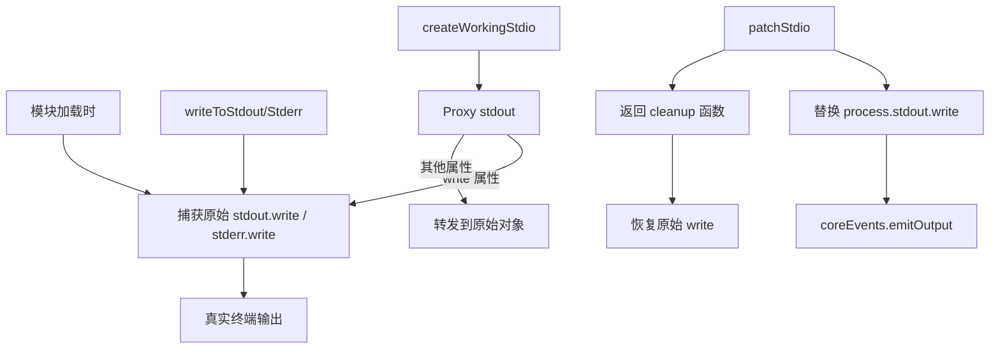

# stdio.ts

> 标准输入输出猴子补丁管理，保护原始 write 方法并支持输出重定向

## 概述
该文件管理 `process.stdout` 和 `process.stderr` 的 write 方法。Gemini CLI 使用 Ink（React 终端 UI 框架）渲染界面，需要拦截所有 stdout/stderr 输出以避免 UI 被第三方库的杂散输出破坏。本模块在加载时捕获原始的 write 方法，提供 `writeToStdout`/`writeToStderr` 函数直接写入真实输出流，同时通过 `patchStdio` 函数将输出重定向到事件系统 (`coreEvents.emitOutput`)。`createWorkingStdio` 通过 Proxy 创建使用原始 write 的 stdout/stderr 代理对象。

## 架构图

## 主要导出

### `function writeToStdout(...args): boolean`
- **用途**: 直接写入真实 stdout，绕过任何猴子补丁。用于 Ink 渲染和关键输出。

### `function writeToStderr(...args): boolean`
- **用途**: 直接写入真实 stderr，绕过任何猴子补丁。

### `function patchStdio(): () => void`
- **用途**: 替换 `process.stdout.write` 和 `process.stderr.write`，将输出重定向到 `coreEvents.emitOutput` 事件系统。返回清理函数用于恢复原始方法。

### `function createWorkingStdio(): { stdout, stderr }`
- **用途**: 创建使用原始 write 方法的 stdout/stderr Proxy 对象。即使在 stdio 被补丁后仍能直接写入真实终端，用于 Ink 渲染器。

## 核心逻辑
- 模块顶层使用 `.bind()` 捕获原始 write 引用，确保在后续补丁后仍可访问。
- `patchStdio` 将 write 替换为转发到 `coreEvents.emitOutput` 的函数，保存补丁前的 write 引用用于恢复。
- `createWorkingStdio` 使用 ES6 Proxy 拦截 `write` 属性访问，返回原始方法；其他属性透传并正确绑定 this。

## 内部依赖
- `./events.js` -- `coreEvents` 事件总线

## 外部依赖
无
