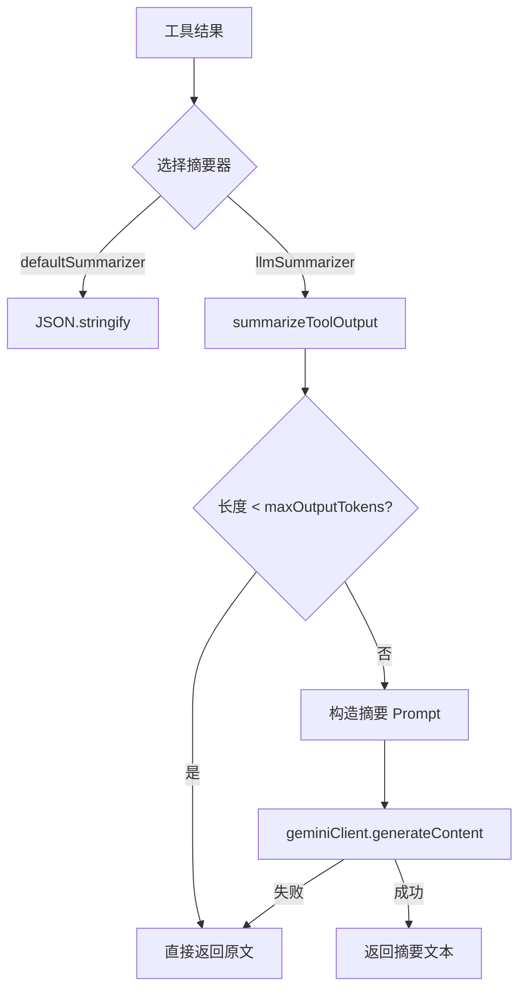

# summarizer.ts

> 工具输出摘要生成器，支持默认 JSON 序列化和 LLM 智能摘要

## 概述
该文件定义了工具执行结果的摘要策略。当工具输出过长时，需要将其压缩为 LLM 上下文窗口可容纳的大小。提供两种摘要器：`defaultSummarizer` 简单地将结果 JSON 序列化；`llmSummarizer` 使用 Gemini API 的摘要模型对输出进行智能总结，保留关键信息（错误栈跟踪、警告等）。摘要提示词针对不同类型的输出（目录列表、文本内容、命令输出）有不同的处理规则。

## 架构图

## 主要导出

### `type Summarizer`
- **签名**: `(config: Config, result: ToolResult, geminiClient: GeminiClient, abortSignal: AbortSignal) => Promise<string>`
- **用途**: 摘要器函数签名。

### `const defaultSummarizer: Summarizer`
- **用途**: 默认摘要器，直接将 `result.llmContent` 序列化为 JSON 字符串。

### `const llmSummarizer: Summarizer`
- **用途**: LLM 摘要器，使用 `summarizer-default` 模型配置调用 `summarizeToolOutput`。

### `function summarizeToolOutput(config, modelConfigKey, textToSummarize, geminiClient, abortSignal): Promise<string>`
- **用途**: 核心摘要函数。若文本长度小于 `maxOutputTokens` 则直接返回；否则构造包含摘要规则的 Prompt 调用 LLM。失败时回退到原文。

## 核心逻辑
- 摘要 Prompt 包含三条规则：(1) 结构化输出（目录列表）根据对话上下文提取需要的信息；(2) 文本内容直接摘要；(3) Shell 命令输出保留完整错误栈跟踪（`<error>` 标签）和警告（`<warning>` 标签）。
- 使用 `modelConfigService.getResolvedConfig` 获取摘要模型的 `maxOutputTokens` 配置。
- 文本长度与 token 数量的简单近似比较（字符数 vs token 数）作为是否需要摘要的判断条件。

## 内部依赖
- `../tools/tools.js` -- `ToolResult` 类型
- `../core/client.js` -- `GeminiClient`
- `./partUtils.js` -- `getResponseText`、`partToString`
- `./debugLogger.js` -- 日志
- `../services/modelConfigService.js` -- `ModelConfigKey`
- `../config/config.js` -- `Config`
- `../telemetry/llmRole.js` -- `LlmRole`

## 外部依赖
- `@google/genai` -- `Content` 类型
