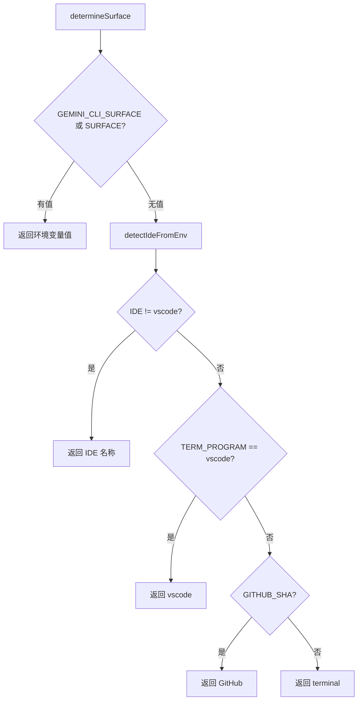

# surface.ts

> 运行环境/分发渠道检测器，识别 CLI 运行在哪种终端或 IDE 中

## 概述
该文件负责确定 Gemini CLI 的运行表面（Surface），即 CLI 运行在什么环境中（VSCode、Cursor、Cloud Shell、GitHub Actions、普通终端等）。这个信息用于遥测分析和环境适配。检测优先级为：(1) `GEMINI_CLI_SURFACE` 环境变量（企业客户显式覆盖）；(2) `SURFACE` 环境变量（向后兼容）；(3) 通过 `detectIdeFromEnv` 自动检测 IDE；(4) GitHub Actions 检测；(5) 回退到 `'terminal'`。

## 架构图

## 主要导出

### `const SURFACE_NOT_SET = 'terminal'`
- **用途**: 默认表面值常量，表示普通终端环境。

### `function determineSurface(): string`
- **用途**: 按优先级检测 CLI 运行环境。返回如 `'vscode'`、`'cursor'`、`'cloudshell'`、`'GitHub'`、`'terminal'` 等标识字符串。

## 核心逻辑
- 先检查显式环境变量覆盖。
- 调用 `detectIdeFromEnv()` 进行 IDE 自动检测。该函数对通用终端会 fallback 到 `'vscode'`，因此需额外检查 `TERM_PROGRAM === 'vscode'` 以避免误判。
- 最后检查 `GITHUB_SHA` 判断是否在 GitHub Actions 中。

## 内部依赖
- `../ide/detect-ide.js` -- `detectIdeFromEnv` IDE 检测

## 外部依赖
无
