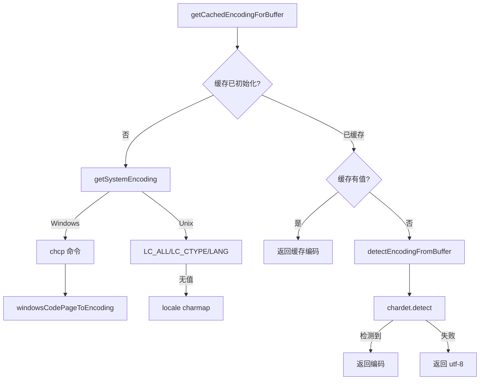

# systemEncoding.ts

> 跨平台系统编码检测工具，支持 Windows 代码页和 Unix locale

## 概述
该文件提供了系统字符编码检测功能，确保 Shell 命令输出能被正确解码。在不同操作系统和区域设置下，命令输出可能使用不同的编码（UTF-8、GBK、Shift-JIS 等）。本模块在 Windows 上通过 `chcp` 命令获取当前代码页并映射为编码名；在 Unix 系统上通过 `LC_ALL`/`LC_CTYPE`/`LANG` 环境变量或 `locale charmap` 命令检测。系统编码结果会被缓存以避免重复系统调用。若系统编码检测失败，可对特定 Buffer 使用 `chardet` 库进行自动检测。

## 架构图

## 主要导出

### `function resetEncodingCache(): void`
- **用途**: 重置编码缓存，用于测试。

### `function getCachedEncodingForBuffer(buffer: Buffer): string`
- **用途**: 获取编码名称。优先返回缓存的系统编码；若系统编码检测失败，则对给定 Buffer 进行自动检测；最终 fallback 到 `'utf-8'`。

### `function getSystemEncoding(): string | null`
- **用途**: 检测系统编码。Windows 用 `chcp`，Unix 用环境变量或 `locale charmap`。返回编码名或 null。

### `function windowsCodePageToEncoding(cp: number): string | null`
- **用途**: 将 Windows 代码页号转换为标准编码名（如 65001 -> `'utf-8'`，936 -> `'gb2312'`）。

### `function detectEncodingFromBuffer(buffer: Buffer): string | null`
- **用途**: 使用 `chardet` 对 Buffer 进行编码自动检测。

## 核心逻辑
- **缓存策略**: 使用三态变量（`undefined` 表示未检测、`null` 表示检测失败、`string` 表示检测到的编码）。系统编码是全局的所以可缓存，但 Buffer 编码因数据不同不缓存。
- **Windows 代码页映射**: 支持 437、850、932（Shift-JIS）、936（GB2312）、949（EUC-KR）、950（Big5）、1250-1258（Windows 系列）、65001（UTF-8）等常见代码页。
- **Unix locale 解析**: 从 `en_US.UTF-8` 格式中提取 `.` 后的编码部分。

## 内部依赖
- `./debugLogger.js` -- 警告日志

## 外部依赖
- `node:child_process` -- `execSync` 执行 `chcp` / `locale charmap`
- `node:os` -- 平台检测
- `chardet` -- Buffer 编码自动检测
