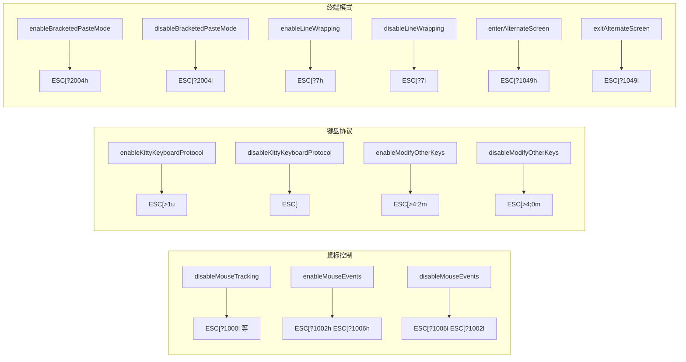

# terminal.ts

> 终端 ANSI 转义序列控制工具集：鼠标追踪、键盘协议、粘贴模式、换行与备用屏幕

## 概述
该文件提供了一组通过 ANSI 转义序列控制终端行为的函数。Gemini CLI 使用自定义终端 UI，需要精确控制鼠标事件追踪、Kitty 键盘协议、modifyOtherKeys 扩展键输入、括号粘贴模式、行换行和备用屏幕缓冲区等功能。所有写入操作通过 `writeToStdout` 绕过猴子补丁，直接输出到终端。

## 架构图

## 主要导出

### 鼠标控制
- **`disableMouseTracking()`** -- 禁用所有鼠标追踪模式（Normal、Any-event、urxvt、SGR、Button-event）
- **`enableMouseEvents()`** -- 启用按钮事件追踪 + SGR 扩展鼠标模式
- **`disableMouseEvents()`** -- 禁用鼠标事件追踪

### 键盘协议
- **`enableKittyKeyboardProtocol()`** -- 启用 Kitty 终端键盘协议
- **`disableKittyKeyboardProtocol()`** -- 禁用 Kitty 终端键盘协议
- **`enableModifyOtherKeys()`** -- 启用 modifyOtherKeys 模式（level 2）
- **`disableModifyOtherKeys()`** -- 禁用 modifyOtherKeys 模式

### 终端模式
- **`enableBracketedPasteMode()`** -- 启用括号粘贴模式（粘贴内容有边界标记）
- **`disableBracketedPasteMode()`** -- 禁用括号粘贴模式
- **`enableLineWrapping()` / `disableLineWrapping()`** -- 启用/禁用自动换行
- **`enterAlternateScreen()` / `exitAlternateScreen()`** -- 进入/退出备用屏幕缓冲区
- **`shouldEnterAlternateScreen(useAlternateBuffer, isScreenReader): boolean`** -- 判断是否应进入备用屏幕（屏幕阅读器模式下禁用）

## 核心逻辑
所有函数通过 `writeToStdout` 发送特定的 ANSI/xterm 转义序列。这些序列遵循标准的终端控制协议（DEC Private Mode、Kitty keyboard protocol 等）。

## 内部依赖
- `./stdio.js` -- `writeToStdout`

## 外部依赖
无
