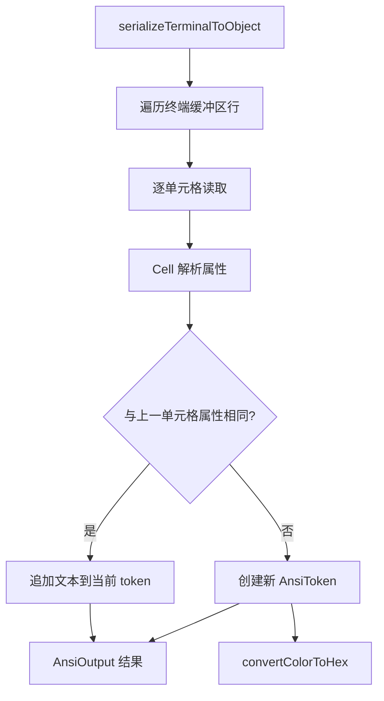

# terminalSerializer.ts

> 将 xterm 虚拟终端缓冲区序列化为带样式信息的结构化对象

## 概述
该文件实现了将 `@xterm/headless`（无头终端模拟器）的缓冲区内容序列化为结构化的 ANSI token 对象。Gemini CLI 在 Shell 工具中使用 xterm 模拟终端以正确处理 ANSI 转义序列，本模块负责将终端状态转换为可渲染的数据结构。每个字符单元包含文本内容和完整的样式信息（粗体、斜体、下划线、暗淡、反色、前景色、背景色）。颜色支持 8 位调色板（256 色）和 24 位 RGB 模式。

## 架构图

## 主要导出

### 类型定义
- **`interface AnsiToken`** -- 单个样式片段：`text`、`bold`、`italic`、`underline`、`dim`、`inverse`、`fg`（前景色 hex）、`bg`（背景色 hex）
- **`type AnsiLine = AnsiToken[]`** -- 一行的 token 数组
- **`type AnsiOutput = AnsiLine[]`** -- 完整输出（行数组）
- **`enum ColorMode`** -- 颜色模式：DEFAULT(0)、PALETTE(1)、RGB(2)

### `function serializeTerminalToObject(terminal, startLine?, endLine?): AnsiOutput`
- **用途**: 将 xterm Terminal 的缓冲区序列化为 `AnsiOutput` 结构。支持指定起止行范围。默认序列化当前视口。

### `function convertColorToHex(color, colorMode, defaultColor): string`
- **用途**: 将颜色值按模式转换为 hex 字符串。RGB 模式直接转换，PALETTE 模式从 256 色表查找，DEFAULT 返回默认色。

## 核心逻辑
- 使用内部 `Cell` 类缓存和比较单元格属性（粗体/斜体/下划线/暗淡/反色/前景色/背景色）。
- 遍历每行每个单元格，若当前单元格与上一个属性相同则追加文本，否则创建新 token。此策略将连续相同样式的字符合并为一个 token，减少输出体积。
- 光标位置通过 `isCursor()` 检测，光标所在单元格的 `inverse` 标记为 true。
- 内置完整的 ANSI 256 色调色板（`ANSI_COLORS` 数组）。

## 内部依赖
无

## 外部依赖
- `@xterm/headless` -- `IBufferCell`、`Terminal` 类型
