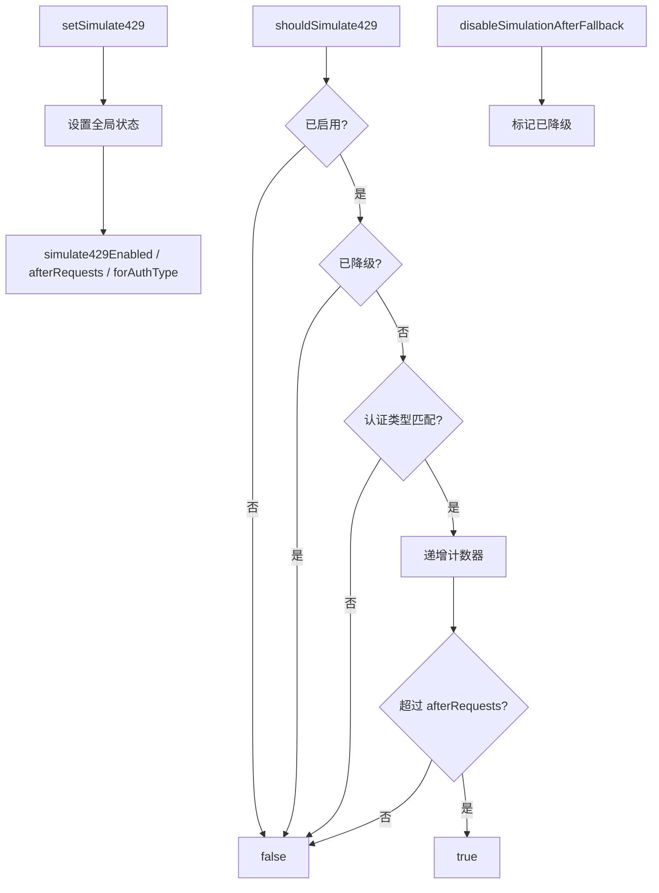

# testUtils.ts

> 429 错误模拟工具，用于单元测试中模拟 API 限流场景

## 概述
该文件提供了一套可编程的 429（Too Many Requests）错误模拟框架，专门用于单元测试。通过全局状态管理，测试代码可以控制何时开始模拟 429 错误、针对哪种认证类型模拟、在多少次请求后触发，以及在模型降级后自动停止模拟。这使得测试可以验证重试逻辑、配额错误处理和模型降级流程。

## 架构图

## 主要导出

### `function shouldSimulate429(authType?: string): boolean`
- **用途**: 判断当前请求是否应模拟 429 错误。受启用状态、认证类型过滤、请求计数阈值和降级标志控制。

### `function resetRequestCounter(): void`
- **用途**: 重置请求计数器。

### `function disableSimulationAfterFallback(): void`
- **用途**: 标记降级已发生，后续请求不再模拟 429。

### `function createSimulated429Error(): Error`
- **用途**: 创建带 `status: 429` 属性的模拟错误对象。

### `function resetSimulationState(): void`
- **用途**: 重置所有模拟状态（降级标志和请求计数器）。

### `function setSimulate429(enabled, afterRequests?, forAuthType?): void`
- **用途**: 配置 429 模拟：启用/禁用、在第 N 次请求后触发、仅对特定认证类型生效。

## 核心逻辑
使用模块级全局变量管理模拟状态。`shouldSimulate429` 依次检查：启用标志 -> 降级标志 -> 认证类型匹配 -> 请求计数阈值。

## 内部依赖
无

## 外部依赖
无
