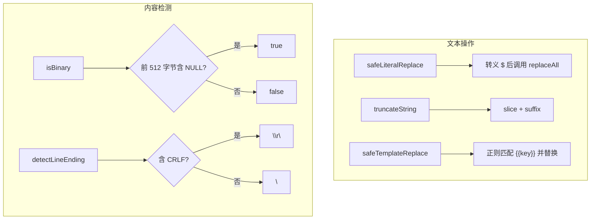

# textUtils.ts

> 文本处理工具集：安全替换、二进制检测、行尾检测、截断和模板插值

## 概述
该文件提供了一组通用的文本处理工具函数，服务于文件编辑、内容处理和模板渲染等场景。核心功能包括：防止 ECMAScript `$` 替换模式干扰的安全字符串替换、通过 NULL 字节检测二进制文件、检测 Windows/Unix 行尾风格、带后缀的字符串截断，以及防止双重插值攻击的安全模板替换。

## 架构图

## 主要导出

### `function safeLiteralReplace(str, oldString, newString): string`
- **用途**: 安全的字面字符串替换。当 `newString` 包含 `$` 时，先转义 `$` 为 `$$` 以避免 ECMAScript 的 `GetSubstitution` 将 `$&`、`$'` 等解释为替换模式。

### `function isBinary(data: Buffer | null | undefined, sampleSize?: number): boolean`
- **用途**: 检测 Buffer 是否为二进制数据。通过检查前 `sampleSize`（默认 512）字节是否包含 NULL 字节（0x00）判断。

### `function detectLineEnding(content: string): '\r\n' | '\n'`
- **用途**: 检测字符串的行尾风格。包含 `\r\n` 返回 Windows 风格，否则返回 Unix 风格。

### `function truncateString(str, maxLength, suffix?): string`
- **用途**: 将字符串截断到指定长度，超长时追加后缀（默认 `'...[TRUNCATED]'`）。

### `function safeTemplateReplace(template, replacements): string`
- **用途**: 安全的模板替换，将 `{{key}}` 占位符替换为 `replacements` 对象中的值。使用单次正则替换防止双重插值攻击（替换后的值不会被再次解释为模板）。

## 核心逻辑
- `safeLiteralReplace`: 关键在于 `newString.replaceAll('$', '$$$$')` -- 需要四个 `$` 因为 `replaceAll` 本身也会解释 `$$` 为字面 `$`。
- `isBinary`: 仅检查采样区内的 NULL 字节，简单高效。
- `safeTemplateReplace`: 使用 `/\{\{(\w+)\}\}/g` 匹配，通过 `Object.prototype.hasOwnProperty.call` 安全检查键是否存在。

## 内部依赖
无

## 外部依赖
无
