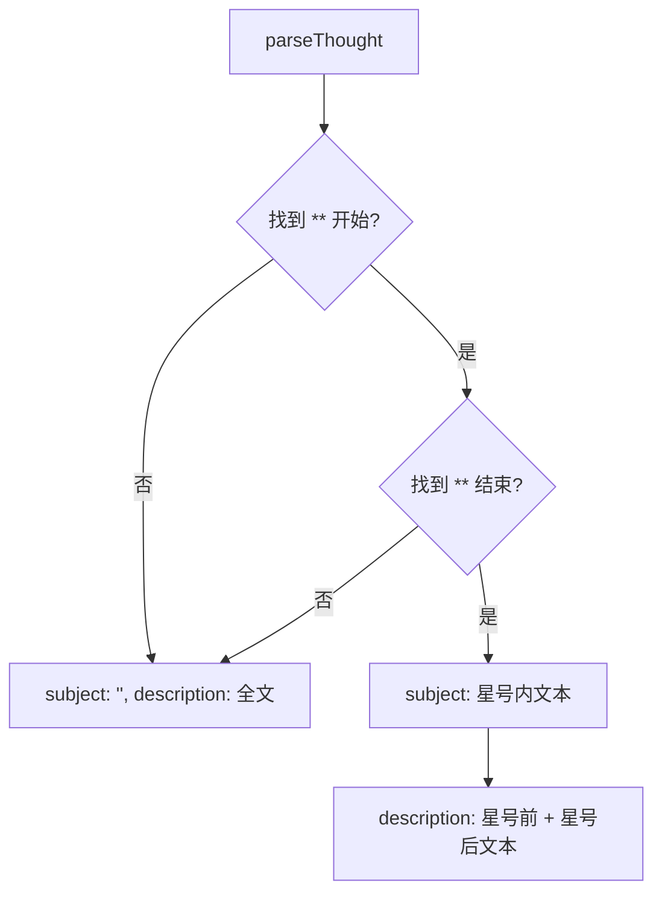

# thoughtUtils.ts

> 模型思考过程文本解析器，提取结构化的主题和描述

## 概述
该文件提供了对 Gemini 模型思考过程（Thought）原始文本的解析功能。模型的思考内容通常包含用双星号 `**` 包裹的主题部分和剩余的描述部分。`parseThought` 函数将这种格式解析为结构化的 `ThoughtSummary` 对象，便于 UI 层以格式化方式展示思考过程（如粗体主题 + 普通描述）。

## 架构图

## 主要导出

### `type ThoughtSummary`
- **签名**: `{ subject: string; description: string }`
- **用途**: 结构化的思考摘要，`subject` 为粗体主题，`description` 为描述文本。

### `function parseThought(rawText: string): ThoughtSummary`
- **用途**: 将原始思考文本解析为结构化对象。查找第一对 `**` 分隔符，提取主题和描述。若无有效主题标记，整段文本作为描述。

## 核心逻辑
1. 查找第一个 `**` 作为主题开始位置。
2. 从开始位置之后查找第二个 `**` 作为主题结束位置。
3. 提取两个分隔符之间的文本为 `subject`，拼接分隔符之前和之后的文本为 `description`。
4. 所有文本均做 `trim()` 处理。

## 内部依赖
无

## 外部依赖
无
