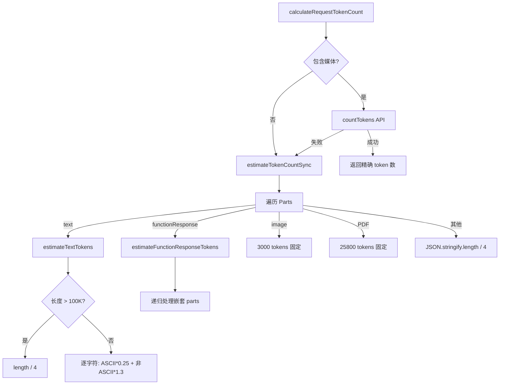

# tokenCalculation.ts

> Token 数量估算工具，支持文本启发式估算和多模态 API 精确计数

## 概述
该文件提供了 Token 数量的估算和计算功能，用于上下文窗口管理。核心策略是"文本本地估算、媒体 API 精确计数"：纯文本和工具调用使用高效的本地启发式方法估算（ASCII 约 4 字符/token，非 ASCII 约 1.3 token/字符）；包含图片或 PDF 等媒体时才调用 `countTokens` API。对大文本（>100K 字符）使用简化的 length/4 近似以避免性能瓶颈。支持 Gemini 3 的嵌套多模态 function response，通过递归处理（限制深度 3）。

## 架构图

## 主要导出

### `function estimateTokenCountSync(parts: Part[], depth?: number): number`
- **用途**: 同步估算 Part 数组的 token 总数。文本使用字符级启发式，媒体使用固定估值，工具响应递归处理。递归深度限制为 3。

### `function calculateRequestTokenCount(request, contentGenerator, model): Promise<number>`
- **用途**: 计算请求的 token 数。纯文本/工具使用本地估算；包含 `inlineData` 或 `fileData` 时调用 `countTokens` API，API 失败时 fallback 到本地估算。

## 核心逻辑
- **文本估算**: 对 100K 以内的文本逐字符判断 ASCII（charCode <= 127）计 0.25 token，非 ASCII 计 1.3 token。超过 100K 使用 length/4 简化。
- **媒体固定估值**: 图片 3000 tokens（覆盖 4K 分辨率），PDF 25800 tokens（按 100 页 * 258 tokens/页估算）。
- **工具响应**: 函数名 length/4 + 响应体 JSON 长度/4 + 递归处理嵌套 parts。
- **递归保护**: `MAX_RECURSION_DEPTH = 3` 防止恶意嵌套导致栈溢出。

## 内部依赖
- `../core/contentGenerator.js` -- `ContentGenerator` 用于调用 countTokens API
- `./debugLogger.js` -- 日志

## 外部依赖
- `@google/genai` -- `PartListUnion`、`Part` 类型
