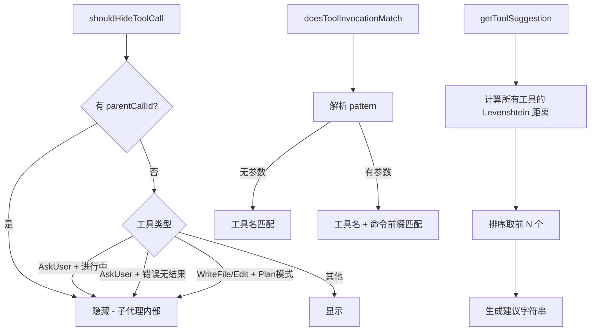

# tool-utils.ts

> 工具调用相关工具函数：类型守卫、显示控制、名称建议和调用匹配

## 概述
该文件提供了一组服务于工具调用管理的实用函数。主要功能包括：(1) `isToolCallResponseInfo` 类型守卫用于运行时检查；(2) `shouldHideToolCall` 控制哪些工具调用在 UI 中隐藏（子代理内部调用、进行中的 AskUser、Plan 模式下的文件写入等）；(3) `getToolSuggestion` 基于 Levenshtein 距离为未知工具名生成"你是不是要找"建议；(4) `doesToolInvocationMatch` 将工具调用与权限模式进行匹配。

## 架构图

## 主要导出

### `function isToolCallResponseInfo(data): data is ToolCallResponseInfo`
- **用途**: 类型守卫，检查对象是否为 `ToolCallResponseInfo`（含 `callId` 和 `responseParts`）。

### `function shouldHideToolCall(params: ShouldHideToolCallParams): boolean`
- **用途**: 判断工具调用是否应在 UI 历史中隐藏。隐藏条件：有 parentCallId（子代理内部调用）、AskUser 进行中或无结果的错误状态、Plan 模式下的 WriteFile/Edit。

### `function getToolSuggestion(unknownToolName, allToolNames, topN?): string`
- **用途**: 为未知工具名生成建议。基于 Levenshtein 编辑距离找到最接近的 N 个工具名，格式化为 `Did you mean "..."?` 字符串。

### `function doesToolInvocationMatch(toolOrToolName, invocation, patterns): boolean`
- **用途**: 检查工具调用是否匹配权限模式列表。模式可以是纯工具名（如 `ReadFileTool`）或带参数前缀（如 `ShellTool(git status)`）。Shell 工具名自动合并（`run_shell_command` 和 `ShellTool` 互通）。

## 核心逻辑
- `shouldHideToolCall`: 使用 switch-case 按工具名分派，结合状态和审批模式判断。
- `getToolSuggestion`: 对所有工具名计算编辑距离，排序后取前 N 个。
- `doesToolInvocationMatch`: 解析括号模式 `ToolName(argPrefix)`, 对 Shell 工具检查命令是否以 argPrefix 开头（精确匹配或空格分隔）。

## 内部依赖
- `../index.js` -- `isTool`、`AnyDeclarativeTool`、`AnyToolInvocation` 类型
- `./shell-utils.js` -- `SHELL_TOOL_NAMES`
- `../policy/types.js` -- `ApprovalMode`
- `../scheduler/types.js` -- `CoreToolCallStatus`、`ToolCallResponseInfo`
- `../tools/tool-names.js` -- 工具显示名常量

## 外部依赖
- `fast-levenshtein` -- Levenshtein 编辑距离计算
