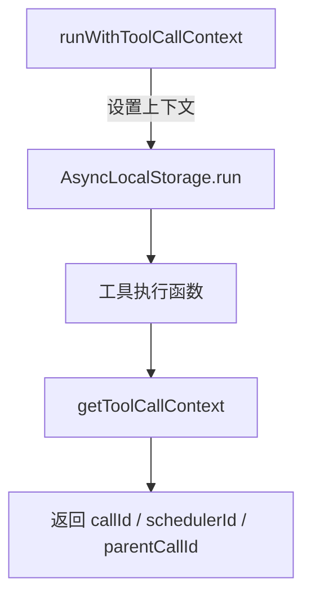

# toolCallContext.ts

> 基于 AsyncLocalStorage 的工具调用上下文管理

## 概述
该文件利用 Node.js `AsyncLocalStorage` 为每次工具调用执行提供上下文信息。在异步调用链中，工具执行代码可以访问当前调用的 ID、调度器 ID 和父调用 ID（用于子代理嵌套场景），无需通过参数逐层传递。这对于遥测记录、日志关联和嵌套工具调用追踪至关重要。

## 架构图

## 主要导出

### `interface ToolCallContext`
- **签名**: `{ callId: string; schedulerId: string; parentCallId?: string }`
- **用途**: 工具调用上下文信息。`parentCallId` 存在时表示这是一个嵌套执行（如子代理中的工具调用）。

### `function runWithToolCallContext<T>(context: ToolCallContext, fn: () => T): T`
- **用途**: 在指定的工具调用上下文中执行函数。所有在 `fn` 内部（包括异步调用链）的代码都可通过 `getToolCallContext()` 访问该上下文。

### `function getToolCallContext(): ToolCallContext | undefined`
- **用途**: 获取当前异步上下文中的工具调用信息。不在工具调用上下文中时返回 `undefined`。

## 核心逻辑
直接封装 `AsyncLocalStorage` 的 `run` 和 `getStore` 方法。`AsyncLocalStorage` 在 Node.js 中通过异步钩子自动在 Promise 链和 async/await 中传播上下文。

## 内部依赖
无

## 外部依赖
- `node:async_hooks` -- `AsyncLocalStorage`
