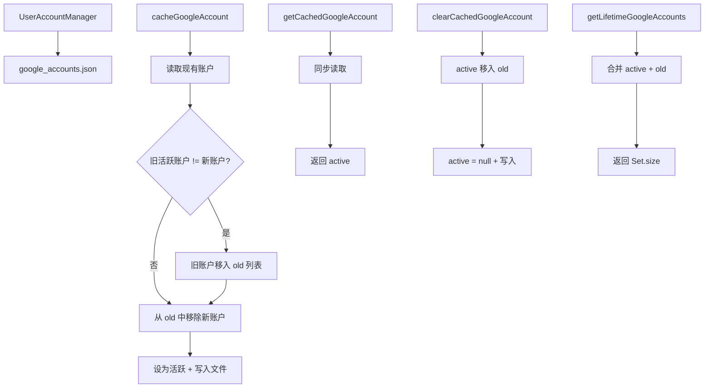

# userAccountManager.ts

> Google 账户缓存管理器，支持活跃账户切换和历史账户追踪

## 概述
该文件实现了 `UserAccountManager` 类，负责管理本地缓存的 Google 账户信息。在 OAuth 登录流程中，CLI 需要记住用户登录过哪些 Google 账户、当前活跃账户是哪个。账户信息以 JSON 格式存储在 `.gemini/google_accounts.json` 文件中。支持设置活跃账户（旧活跃账户自动移入历史列表）、读取当前活跃账户、统计历史账户总数、清除活跃账户等操作。

## 架构图

## 主要导出

### `class UserAccountManager`
- **`cacheGoogleAccount(email: string): Promise<void>`** -- 缓存 Google 账户。若存在不同的活跃账户，将其移入历史列表；若新账户在历史列表中则移除。
- **`getCachedGoogleAccount(): string | null`** -- 同步读取当前活跃的 Google 账户邮箱。
- **`getLifetimeGoogleAccounts(): number`** -- 返回曾使用过的所有 Google 账户总数（含活跃和历史）。
- **`clearCachedGoogleAccount(): Promise<void>`** -- 清除活跃账户（移入历史列表）。

## 核心逻辑
- **数据结构**: `{ active: string | null, old: string[] }` -- `active` 为当前账户，`old` 为历史账户列表。
- **账户切换**: 设置新活跃账户时，旧活跃账户被追加到 `old`（若不重复），新账户从 `old` 中移除。
- **读写双模式**: `readAccountsSync`（同步）用于需要同步返回的场景（`getCachedGoogleAccount`），`readAccounts`（异步）用于写入前的读取。
- **健壮性**: JSON 解析和文件读取均有 try-catch，ENOENT 返回默认空状态，无效格式重新初始化。

## 内部依赖
- `../config/storage.js` -- `Storage.getGoogleAccountsPath()` 获取文件路径
- `./debugLogger.js` -- 日志

## 外部依赖
- `node:path` -- 路径操作
- `node:fs` / `node:fs/promises` -- 文件读写
