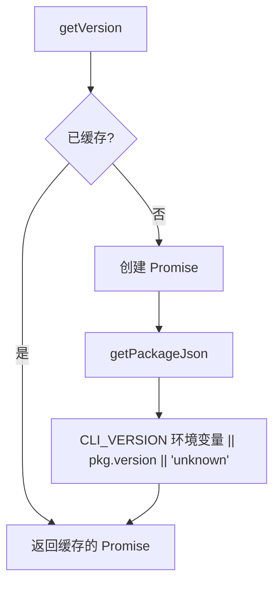

# version.ts

> CLI 版本号获取器，支持环境变量覆盖和 package.json 读取

## 概述
该文件提供了获取 Gemini CLI 版本号的函数。版本号的来源优先级为：(1) `CLI_VERSION` 环境变量（用于 CI/CD 构建注入）；(2) `package.json` 中的 `version` 字段；(3) fallback 到 `'unknown'`。版本号获取结果会被缓存（Promise 级别），避免重复读取文件。

## 架构图

## 主要导出

### `function getVersion(): Promise<string>`
- **用途**: 获取 CLI 版本号。首次调用时从环境变量或 `package.json` 读取并缓存结果。

### `function resetVersionCache(): void`
- **用途**: 重置版本号缓存，仅用于测试。

## 核心逻辑
使用模块级 `versionPromise` 变量缓存 Promise。首次调用 `getVersion` 时创建并缓存 Promise，后续调用直接返回同一个 Promise。

## 内部依赖
- `./package.js` -- `getPackageJson` 读取 package.json

## 外部依赖
- `node:url` -- `fileURLToPath`
- `node:path` -- `dirname`
