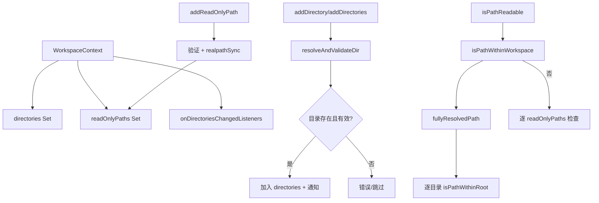

# workspaceContext.ts

> 多目录工作区管理器，负责目录注册、路径验证和变更通知

## 概述
该文件实现了 `WorkspaceContext` 类，是 Gemini CLI 工作区管理的核心组件。它维护一组工作区目录，提供目录的添加/移除、路径校验（是否在工作区内、是否可读）、变更监听等功能。工作区可以包含多个目录（不仅是 cwd），支持只读路径的额外注册。所有路径在添加时会解析符号链接并校验存在性。路径检查使用 `resolveToRealPath` 确保符号链接被正确处理。

## 架构图

## 主要导出

### `type Unsubscribe = () => void`
- **用途**: 取消订阅函数类型。

### `interface AddDirectoriesResult`
- **签名**: `{ added: string[]; failed: Array<{ path: string; error: Error }> }`
- **用途**: 批量添加目录的结果，包含成功列表和失败列表。

### `class WorkspaceContext`
- **`constructor(targetDir: string, additionalDirectories?: string[])`** -- 创建工作区上下文。`targetDir` 为主目录，可选附加目录。
- **`onDirectoriesChanged(listener): Unsubscribe`** -- 注册目录变更监听器，返回取消订阅函数。
- **`addDirectory(directory: string): void`** -- 添加单个目录，失败时抛出异常。
- **`addDirectories(directories: string[]): AddDirectoriesResult`** -- 批量添加目录，返回成功/失败结果。变更时发出一次通知。
- **`addReadOnlyPath(pathToAdd: string): void`** -- 添加只读路径（允许读取但不允许写入）。
- **`getDirectories(): readonly string[]`** -- 获取所有工作区目录。
- **`getInitialDirectories(): readonly string[]`** -- 获取初始化时的目录集合。
- **`setDirectories(directories: readonly string[]): void`** -- 替换整个目录集合，仅在实际变化时通知。
- **`isPathWithinWorkspace(pathToCheck: string): boolean`** -- 检查路径是否在任一工作区目录内（解析符号链接后）。
- **`isPathReadable(pathToCheck: string): boolean`** -- 检查路径是否可读（工作区内或只读路径内）。

## 核心逻辑
- **目录验证**: `resolveAndValidateDir` 将路径解析为绝对路径，检查存在性和目录类型，最后 `realpathSync` 解析符号链接。
- **路径检查**: `fullyResolvedPath` 使用 `resolveToRealPath` 完全解析路径（包括符号链接），然后通过 `path.relative` 判断是否在根目录内（相对路径不以 `..` 开头且不是绝对路径）。
- **变更通知**: 使用 Set 管理监听器，通知时迭代副本以防止并发修改问题。每个监听器调用独立 try-catch。
- **只读路径**: 独立于工作区目录管理，支持精确匹配和子路径匹配。

## 内部依赖
- `./debugLogger.js` -- 日志
- `./paths.js` -- `resolveToRealPath` 路径解析

## 外部依赖
- `node:fs` -- 文件系统操作
- `node:path` -- 路径处理
