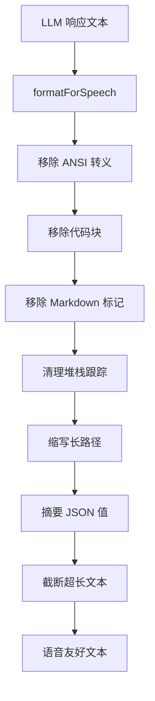

# voice 架构

> 语音输出格式化模块，将 Markdown 和代码响应转换为适合语音朗读的纯文本

## 概述

`voice` 模块提供 `formatForSpeech` 函数，用于将 LLM 生成的 Markdown 格式响应转换为适合语音合成（TTS）朗读的纯文本。它会移除 ANSI 转义序列、Markdown 格式标记（代码块、粗体斜体、标题、链接、列表标记、引用等）、堆栈跟踪、长绝对路径，并对 JSON 值进行摘要处理。支持配置最大输出长度、路径缩写深度和 JSON 阈值。

## 架构图



## 目录结构

```
voice/
└── responseFormatter.ts   # 语音输出格式化器
```

## 关键文件

| 文件 | 功能 |
|------|------|
| `responseFormatter.ts` | `formatForSpeech` 函数，接收原始 Markdown 文本和可选配置（maxLength=500, pathDepth=3, jsonThreshold=80），依次执行：(1) 移除 ANSI 转义序列；(2) 替换代码块为 "code snippet" 占位符；(3) 移除内联代码反引号；(4) 移除粗体/斜体标记；(5) 移除引用前缀；(6) 移除标题标记；(7) 提取链接文本；(8) 移除列表标记；(9) 替换堆栈跟踪为 "stack trace omitted"；(10) 缩写长绝对路径（保留最后 N 段）；(11) 摘要超长 JSON 值；(12) 规范化空白；(13) 截断至 maxLength |

## 内部依赖

无。`responseFormatter.ts` 是一个独立的纯函数模块，不依赖其他模块。

## 外部依赖

无。仅使用正则表达式处理文本。
