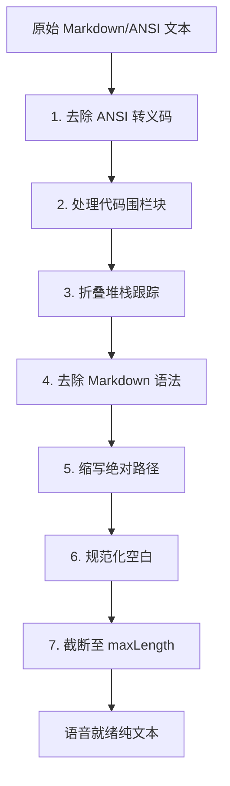

# responseFormatter.ts

> 将 Markdown/ANSI 格式的文本转换为适合语音朗读的纯文本。

## 概述

`responseFormatter.ts` 提供 `formatForSpeech` 函数，用于将 Gemini 模型返回的富文本响应（包含 Markdown 语法、ANSI 转义码、代码块、堆栈跟踪、绝对路径等）转换为简洁的语音友好型纯文本。该文件是语音输出模式的核心文本预处理器，通过一系列正则表达式变换逐步清理和简化文本内容。

## 架构图

## 主要导出

### 接口

- **`FormatForSpeechOptions`** — 可选配置：
  - `maxLength?: number`（默认 500）-- 最大输出字符数
  - `pathDepth?: number`（默认 3）-- 路径缩写保留的尾部段数
  - `jsonThreshold?: number`（默认 80）-- JSON 值超过此长度时生成摘要

### 函数

| 函数 | 签名 | 说明 |
|------|------|------|
| `formatForSpeech` | `(text: string, options?: FormatForSpeechOptions) => string` | 将富文本转换为语音就绪的纯文本 |

## 核心逻辑

按顺序应用 7 步变换管道：

1. **ANSI 清理**：匹配 CSI、OSC 等转义序列并移除。
2. **代码围栏处理**：对超过 `jsonThreshold` 长度的代码块内容尝试 JSON 解析并摘要化（如 "(JSON object with 5 keys)"），否则保留原文。
3. **堆栈跟踪折叠**：将连续 2 行以上的 `at ...` 堆栈帧替换为首行 + `(and N more frames)`。
4. **Markdown 语法移除**：依次处理内联代码、加粗/斜体、引用、标题、链接、列表标记。
5. **路径缩写**：将 Unix 和 Windows 绝对路径缩短为 `.../<尾部N段>`，行号后缀转换为 `line N` 格式。
6. **空白规范化**：将 3 个以上连续换行压缩为 2 个，去除首尾空白。
7. **截断**：超过 `maxLength` 时截断并附加 `... (N chars total)` 提示。

## 内部依赖

无。

## 外部依赖

无。
