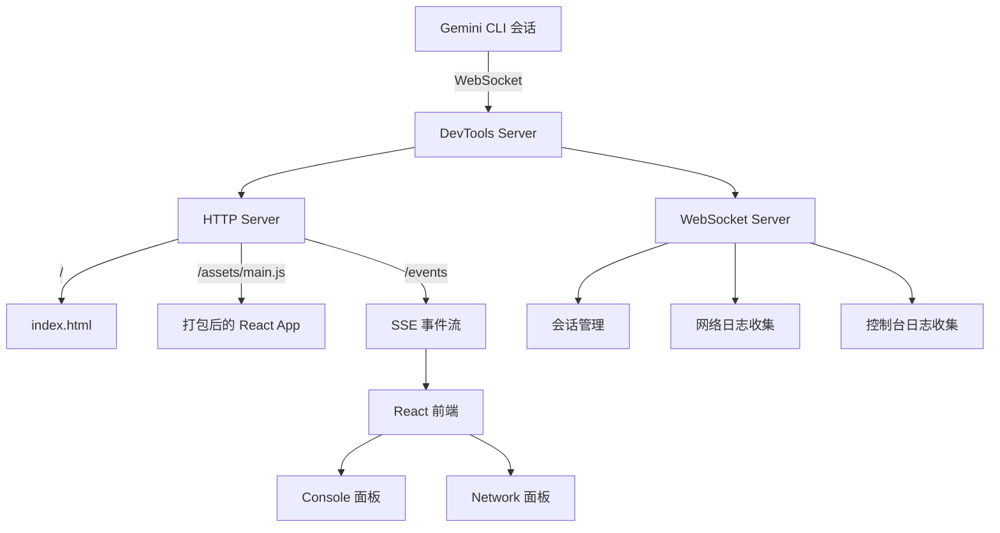

# devtools 架构

> Gemini CLI 开发者工具，提供实时网络请求和控制台日志的 Web 查看器，用于调试 CLI 会话。

## 概述

`devtools` 包实现了一个独立的开发者工具查看器，类似于浏览器的 DevTools。它通过内置的 HTTP + WebSocket 服务器接收来自 CLI 会话的网络请求日志和控制台日志，并通过 SSE（Server-Sent Events）将数据推送到 React 前端界面。支持多会话管理、日志导入/导出、明暗主题切换、JSON 语法高亮等功能。采用单例模式确保每个进程只有一个 DevTools 实例。

## 架构图



## 目录结构

```
packages/devtools/
├── package.json           # 依赖 ws、react、react-dom
├── src/
│   ├── index.ts           # DevTools 服务器类（HTTP + WebSocket）
│   ├── types.ts           # NetworkLog、ConsoleLog 类型定义
│   └── _client-assets.ts  # 自动生成：内嵌 HTML 和 JS 资源
├── client/
│   ├── index.html         # 前端 HTML 入口
│   └── src/
│       ├── main.tsx       # React 渲染入口
│       ├── App.tsx        # 主应用组件
│       └── hooks.ts       # SSE 数据 Hook
├── esbuild.client.js      # 客户端构建脚本
├── tsconfig.json
└── tsconfig.build.json
```

## 关键文件

| 文件 | 功能 |
|------|------|
| `src/index.ts` | DevTools 主类，详见 src/ARCHITECTURE.md |
| `src/types.ts` | NetworkLog、ConsoleLogPayload、InspectorConsoleLog 类型定义 |
| `client/src/App.tsx` | React 前端主组件，详见 client/ARCHITECTURE.md |
| `esbuild.client.js` | 用 esbuild 打包 React 客户端，生成 `_client-assets.ts` 内嵌资源文件 |

## 内部依赖

- `src/` - 服务器端逻辑
- `client/` - 前端 UI

## 外部依赖

| 包名 | 用途 |
|------|------|
| `ws` | WebSocket 服务器 |
| `react` | 前端 UI 框架（devDependency） |
| `react-dom` | React DOM 渲染（devDependency） |
